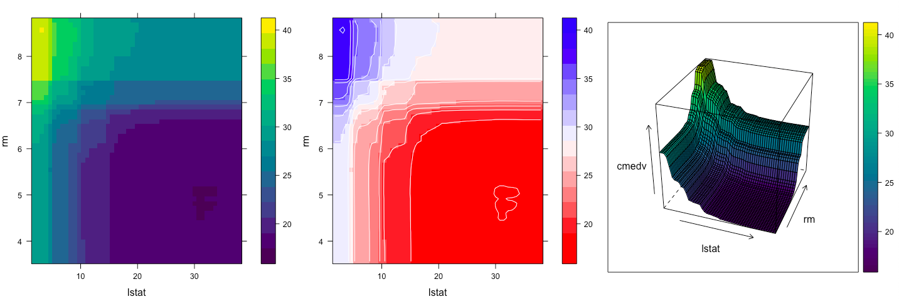

```{r setup, include=FALSE}
knitr::opts_chunk$set(echo = TRUE, cache = TRUE, warning = FALSE, message = FALSE)
library(dplyr)
```

# Introduction
In this paper commentary is made in this way: firstly reproduced graph, then comment about it.\
Keep in mind that images reproduced here are generally wider than in the corresponding paper.\


## "Network Visualization with ggplot2"
In this section, it is tried to reproduce graphs from [this](https://journal.r-project.org/archive/2017/RJ-2017-023/RJ-2017-023.pdf) article. Unfortunately, authors didn't provide `.R` file, therefore it was essential to copy code directly from the paper.\

```{r}
library(GGally)
library(network)
# make the data available
data(madmen, package = 'geomnet')
# data step for both ggnet2 and ggnetwork
# create undirected network
mm.net <- network(madmen$edges[, 1:2], directed = FALSE)
#mm.net # glance at network object
## Network attributes:
##   vertices = 45
##   directed = FALSE
##   hyper = FALSE
##   loops = FALSE
##   multiple = FALSE
##   bipartite = FALSE
##   total edges= 39
##     missing edges= 0
## non-missing edges= 39 ##
## Vertex attribute names:
## vertex.names
##
## No edge attributes
# create node attribute (gender)
rownames(madmen$vertices) <- madmen$vertices$label
mm.net %v% "gender" <- as.character(
madmen$vertices[ network.vertex.names(mm.net), "Gender"] )
# gender color palette
mm.col <- c("female" = "#ff69b4", "male" = "#0099ff") # create plot for ggnet2
set.seed(10052016)
ggnet2(mm.net, color = mm.col[ mm.net %v% "gender" ],
       labelon = TRUE, label.color = mm.col[ mm.net %v% "gender" ], size = 2, vjust = -0.6, mode = "kamadakawai", label.size = 3)
```
\
As we can see in this graph, there are no labels on vertices, even though vertices should be labeled here. It is caused by the lack of the flag `label = TRUE` in the `ggnet2` function. We can see here the casualness of authors. Similar examples will be delivered later.\
Improved graph:\
```{r}
set.seed(10052016)
ggnet2(mm.net, color = mm.col[ mm.net %v% "gender" ],
       labelon = TRUE, label.color = mm.col[ mm.net %v% "gender" ], size = 2, vjust = -0.6, mode = "kamadakawai", label.size = 3, label = TRUE)
```
\
After this small adjustment, a produced graph is exactly the same as the one shown in the paper.\

```{r}
# also loads ggplot2
library(geomnet)
# data step: join the edge and node data with a fortify call
MMnet <- fortify(as.edgedf(madmen$edges), madmen$vertices)
# create plot
set.seed(10052016)
ggplot(data = MMnet, aes(from_id = from_id, to_id = to_id)) + geom_net(aes(colour = Gender), layout.alg = "kamadakawai",
                                                                       size = 2, labelon = TRUE, vjust = -0.6, ecolour = "grey60",
                                                                       directed =FALSE, fontsize = 3, ealpha = 0.5) + scale_colour_manual(values = c("#FF69B4", "#0099ff")) + xlim(c(-0.05, 1.05)) +
  theme_net() +
  theme(legend.position = "bottom")
```
\
This graph is reproduced correctly.\


```{r}
# create plot for ggnetwork. uses same data created for ggnet2 function
library(ggnetwork)
set.seed(10052016)
ggplot(data = ggnetwork(mm.net, layout = "kamadakawai"),
       aes(x, y, xend = xend, yend = yend)) +
  geom_edges(color = "grey50") + # draw edge layer
  geom_nodes(aes(colour = gender), size = 2) + # draw node layer
  geom_nodetext(aes(colour = gender, label = vertex.names),
  size = 3, vjust = -0.6) + # draw node label layer
  scale_colour_manual(values = mm.col) +
  xlim(c(-0.05, 1.05)) + theme_blank() + theme(legend.position = "bottom")
```
\
This graph is reproduced correctly.\


```{r}
data(blood, package = "geomnet")
# plot with ggnet2 (Figure 5a)
set.seed(12252016)
ggnet2(network(blood$edges[, 1:2], directed=TRUE),
       mode = "circle", size = 15, label = TRUE, arrow.size = 10, arrow.gap = 0.05, vjust = 0.5, node.color = "darkred", label.color = "grey80")
```
\
This graph is reproduced correctly.\

```{r}
set.seed(12252016)
ggplot(data = blood$edges, aes(from_id = from, to_id = to)) +
  geom_net(colour = "darkred", layout.alg = "circle", labelon = TRUE, size = 15, directed = TRUE, vjust = 0.5, labelcolour = "grey80",
           arrowsize = 1.5, linewidth = 0.5, arrowgap = 0.05,
           selfloops = TRUE, ecolour = "grey40") +
  theme_net()
```
\
This graph is reproduced correctly.\

```{r}
set.seed(12252016)
ggplot(ggnetwork(network(blood$edges[, 1:2]),
layout = "circle", arrow.gap = 0.05), aes(x, y, xend = xend, yend = yend)) +
  geom_edges(color = "grey50",
             arrow = arrow(length = unit(10, "pt"), type = "closed")) +
  geom_nodes(size = 15, color = "darkred") + geom_nodetext(aes(label = vertex.names), color = "grey80") + theme_blank()
```
\
This graph is reproduced correctly.\
```{r}
# make data accessible
data(email, package = 'geomnet')
# create node attribute data
em.cet <- as.character(
email$nodes$CurrentEmploymentType)
names(em.cet) = email$nodes$label
# remove the emails sent to all employees
edges <- subset(email$edges, nrecipients < 54) # create network
em.net <- edges[, c("From", "to") ]
em.net <- network(em.net, directed = TRUE)
# create employee type node attribute
em.net %v% "curr_empl_type" <-
  em.cet[ network.vertex.names(em.net) ]
set.seed(10312016)
ggnet2(em.net, color = "curr_empl_type",
       size = 4, palette = "Set1", arrow.gap = 0.02, arrow.size = 5, edge.alpha = 0.25,
       mode = "fruchtermanreingold",
       edge.color = c("color", "grey50"), color.legend = "Employment Type") +
  theme(legend.position = "bottom")
```
\
It is another example of casualness. Originally at the end of the code provided by the authors, there is a `}` sign. Therefore it is uncompilable. What's more, and there is a lot of such examples in this paper, a produced graph is very similar to the one in the paper, but not exactly the same. One can think it out by himself whether he considers it reproduced. In this paper, it is considered unreproducible, because in a situation, where authors use a function `set.seed()` it is expected to receive exactly the same outputs.\

```{r}
email$edges <- email$edges[, c(1,5,2:4,6:9)]
emailnet <- fortify(
  as.edgedf(subset(email$edges, nrecipients < 54)),
  email$nodes)
set.seed(10312016)
ggplot(data = emailnet,
                                         aes(from_id = from_id, to_id = to_id)) + geom_net(layout.alg = "fruchtermanreingold",
                                                                                           aes(colour = CurrentEmploymentType,
                                                                                               group = CurrentEmploymentType,
                                                                                               linewidth = 3 * (...samegroup.. / 8 + .125)),
                                                                                           ealpha = 0.25, size = 4, curvature = 0.05,
                                                                                           directed = TRUE, arrowsize = 0.5) + scale_colour_brewer("Employment Type", palette = "Set1") + theme_net() +
  theme(legend.position = "bottom")
```
\
Output is slightly different, despite usage of `set.seed()` function.\

```{r}
set.seed(10312016)
ggplot(ggnetwork(em.net, arrow.gap = 0.02,
layout = "fruchtermanreingold"),
aes(x, y, xend = xend, yend = yend)) +
  geom_edges(
    aes(color = curr_empl_type),
    alpha = 0.25,
    arrow = arrow(length = unit(5, "pt"),
                  type = "closed"), curvature = 0.05) +
  geom_nodes(aes(color = curr_empl_type), size = 4) +
  scale_color_brewer("Employment Type", palette = "Set1") +
  theme_blank() + theme(legend.position = "bottom")
```
\
Output is slightly different, despite usage of `set.seed()` function.\

```{r}
# data preparation. first, remove emails sent to all employees
em.day <- subset(email$edges, nrecipients < 54)[, c("From", "to", "day") ] # for small multiples by day, create one element in a list per day
# (10 days, 10 elements in the list em.day)
em.day <- lapply(unique(em.day$day),
                 function(x) subset(em.day, day == x)[, 1:2 ])

# make the list of edgelists a list of network objects for plotting with ggnet2
em.day <- lapply(em.day, network, directed = TRUE)
# create vertex (employee type) and network (day) attributesfor each element in list
for (i in 1:length(em.day)) {
em.day[[ i ]] %v% "curr_empl_type" <-
  em.cet[ network.vertex.names(em.day[[ i ]]) ]
em.day[[ i ]] %n% "day" <- unique(email$edges$day)[ i ] }

# plot ggnet2
# first, make an empty list containing slots for the 10 days (one plot per day)
g <- list(length(em.day))
set.seed(7042016)
# create a ggnet2 plot for each element in the list of networks
for (i in 1:length(em.day)) {
  g[[ i ]] <- ggnet2(em.day[[ i ]], size = 2, color = "curr_empl_type",
                     palette = "Set1", arrow.size = 0, arrow.gap = 0.01, edge.alpha = 0.1, legend.position = "none",
                     mode = "kamadakawai") +
    ggtitle(paste("Day", em.day[[ i ]] %n% "day")) + theme(panel.border = element_rect(color = "grey50", fill = NA),
                                                           aspect.ratio = 1)
}
# arrange all of the network plots into one plot window
gridExtra::grid.arrange(grobs = g, nrow = 2)
```
\
This graph is reproduced correctly.\

```{r}
# data step: use the fortify.edgedf group argument to
# combine the edge and node data and allow all nodes to
# show up on all days. Also, remove emails sent to all
# employees
emailnet <- fortify(as.edgedf(subset(email$edges, nrecipients < 54)), email$nodes, group = "day")
# creating the plot
set.seed(7042016)
ggplot(data = emailnet, aes(from_id = from, to_id = to_id)) +
  geom_net(layout.alg = "kamadakawai", singletons = FALSE, aes(colour = CurrentEmploymentType,
                                                               group = CurrentEmploymentType,
                                                               linewidth = 2 * (...samegroup.. / 8 + .125)),
           arrowsize = .5,
           directed = TRUE, fiteach = TRUE, ealpha = 0.5, size = 1.5, na.rm = FALSE) +
  scale_colour_brewer("Employment Type", palette = "Set1") + theme_net() +
  facet_wrap(~day, nrow = 2, labeller = "label_both") + theme(legend.position = "bottom",
                                                              panel.border = element_rect(fill = NA, colour = "grey60"), plot.margin = unit(c(0, 0, 0, 0), "mm"))
```
\
This graph is reproduced correctly.\

```{r}
# create the network and aesthetics
# first, remove emails sent to all employees
edges <- subset(email$edges, nrecipients < 54)
edges <- edges[, c("From", "to", "day") ]
# Create network class object for plotting with ggnetwork
em.net <- network(edges[, 1:2])
# assign edge attributes (day)
set.edge.attribute(em.net, "day", edges[, 3])
# assign vertex attributes (employee type)
em.net %v% "curr_empl_type" <- em.cet[ network.vertex.names(em.net) ]
# create the plot
set.seed(7042016)
ggplot(ggnetwork(em.net, arrow.gap = 0.02, by = "day",
                 layout = "kamadakawai"),
       aes(x, y, xend = xend, yend = yend)) +
  geom_edges(
    aes(color = curr_empl_type),
    alpha = 0.25,
    arrow = arrow(length = unit(5, "pt"), type = "closed")) +
  geom_nodes(aes(color = curr_empl_type), size = 1.5) + scale_color_brewer("Employment Type", palette = "Set1") + facet_wrap(~day, nrow = 2, labeller = "label_both") + theme_facet(legend.position = "bottom")
```
\
This graph is reproduced correctly.\

```{r}
# make data accessible
data(theme_elements, package = "geomnet")
# create network object
te.net <- network(theme_elements$edges)
# assign node attribut (size based on node degree)
te.net %v% "size" <-
  sqrt(10 * (sna::degree(te.net) + 1))
set.seed(3272016)
ggnet2(te.net, label = TRUE, color = "white",
       label.size = "size", layout.exp = 0.15, mode = "fruchtermanreingold")
```
\
Output is slightly different, despite usage of `set.seed()` function.\

```{r}
# data step: merge nodes and edges and # introduce a degree-out variable
# data step: merge nodes and edges and # introduce a degree-out variable
TEnet <- fortify(
as.edgedf(theme_elements$edges[,c(2,1)]), theme_elements$vertices)
TEnet <- TEnet %>%
  group_by(from_id) %>%
  mutate(degree = sqrt(10 * n() + 1))
# create plot:
set.seed(3272016)
ggplot(data = TEnet,
aes(from_id = from_id, to_id = to_id)) + geom_net(layout.alg = "fruchtermanreingold",
                                                  aes(fontsize = degree), directed = TRUE,
                                                  labelon = TRUE, size = 1, labelcolour = 'black', ecolour = "grey70", arrowsize = 0.5,
                                                  linewidth = 0.5, repel = TRUE) +
  theme_net() + xlim(c(-0.05, 1.05))
```
\
Output is slightly different, despite usage of `set.seed()` function.\

```{r}
set.seed(3272016)
# use network created in ggnet2 data step
ggplot(ggnetwork(te.net,
layout = "fruchtermanreingold"),
aes(x, y, xend = xend, yend = yend)) + geom_edges() +
geom_nodes(size=12,color="white")+ geom_nodetext(
  aes(size = size, label = vertex.names)) + scale_size_continuous(range = c(4, 8)) + guides(size = FALSE) +
  theme_blank()
```
\
Output is slightly different, despite usage of `set.seed()` function.\

```{r}
#make data accessible
data(football, package = 'geomnet')
rownames(football$vertices) <-
football$vertices$label
# create network
fb.net <- network(football$edges[, 1:2],
                  directed = TRUE)
# create node attribute
# (what conference is team in?)
fb.net %v% "conf" <-
football$vertices[ network.vertex.names(fb.net), "value" ]
# create edge attribute
# (between teams in same conference?)
set.edge.attribute(
fb.net, "same.conf",
football$edges$same.conf)
set.seed(5232011)
ggnet2(fb.net, mode = "fruchtermanreingold",
       color = "conf", palette = "Paired", color.legend = "Conference", edge.color = c("color", "grey75"))
```
\
Output is slightly different, despite usage of `set.seed()` function.\

```{r}
# data step: merge vertices and edges
# data step: merge vertices and edges
ftnet <- fortify(as.edgedf(football$edges),
football$vertices)
# create new label variable for independent schools
ftnet$schools <- ifelse(
ftnet$value == "Independents", ftnet$from_id, "")
# create data plot
set.seed(5232011)
ggplot(data = ftnet,
aes(from_id = from_id, to_id = to_id)) + geom_net(layout.alg = 'fruchtermanreingold',
                                                  aes(colour = value, group = value, linetype = factor(same.conf != 1), label = schools),
                                                  linewidth = 0.5,
                                                  size = 5, vjust = -0.75, alpha = 0.3) +
  theme_net() +
  theme(legend.position = "bottom") + scale_colour_brewer("Conference", palette = "Paired") +
guides(linetype = FALSE)
```
\
It is another example of casualness. Originally, there was a lack of sign `+` at the end of the next-to-last line. Output is slightly different, despite usage of `set.seed()` function.\

```{r}
# use network from ggnet2 step
set.seed(5232011)
ggplot(
  ggnetwork( fb.net,
             layout = "fruchtermanreingold"), aes(x, y, xend = xend, yend = yend)) + geom_edges(
               aes(linetype = as.factor(same.conf)),
               color = "grey50") + geom_nodes(aes(color = conf), size = 4) + scale_color_brewer("Conference",
                                                                                                palette = "Paired") + scale_linetype_manual(values = c(2,1)) +
  guides(linetype = FALSE) + theme_blank()
```
\
Output is slightly different, despite usage of `set.seed()` function.\

```{r}
library(tnet)
data(tnet)
elist <- data.frame(Davis.Southern.women.2mode)
names(elist) <- c("Lady", "Event")

head(elist,4)
elist$Lady <- paste("L", elist$Lady, sep="")
elist$Event <- paste("E", elist$Event, sep="")

davis <- elist
names(davis) <- c("from", "to")
davis <- rbind(davis, data.frame(from=davis$to, to=davis$from))
davis$type <- factor(c(rep("Lady", nrow(elist)), rep("Event", nrow(elist))))


# make data accessible
data(bikes, package = 'geomnet')
# data step for geomnet
tripnet <- fortify(as.edgedf(bikes$trips), bikes$stations[,c(2,1,3:5)]) # create variable to identify Metro Stations
tripnet$Metro = FALSE
idx <- grep("Metro", tripnet$from_id)
tripnet$Metro[idx] <- TRUE


set.seed(1232016)
ggplot(aes(from_id = from_id, to_id = to_id), data = tripnet) +
  geom_net(aes(linewidth = n / 15, colour = Metro), labelon = TRUE, repel = TRUE) +
  theme_net() +
  xlim(c(-0.1, 1.1)) +
  scale_colour_manual("Metro Station", values = c("grey40", "darkorange")) + theme(legend.position = "bottom")
```
\
It is an interesting one. There is no such graph in a paper. It is mentioned that it is shown in `Figure 7b`, but it is not true. This graph is similar to one in `Figure 8`, but is not similar enough to identify as `b`, `c` or `d`. We can only use the elimination method to conclude it was supposed to be the `Figure 8b`. It is because the `c` was supposed to be produced by the `ggnet2` package, which is provided in the next graph and the `d` is quite similar to the graph provided in one after the next.\

```{r}
# data preparation for ggnet2 and ggnetwork
bikes.net <- network(bikes$trips[, 1:2 ], directed = FALSE)
# create edge attribute (number of trips)
network::set.edge.attribute(bikes.net, "n", bikes$trips[, 3 ] / 15)
# create vertex attribute for Metro Station
bikes.net %v% "station" <- grepl("Metro", network.vertex.names(bikes.net))
bikes.net %v% "station" <- 1 + as.integer(bikes.net %v% "station")
rownames(bikes$stations) <- bikes$stations$name
# create node attributes (coordinates)
bikes.net %v% "lon" <-
  bikes$stations[ network.vertex.names(bikes.net), "long" ]
bikes.net %v% "lat" <-
  bikes$stations[ network.vertex.names(bikes.net), "lat" ]
bikes.col <- c("grey40", "darkorange")


set.seed(1232016)
ggnet2(bikes.net, mode = "fruchtermanreingold", size = 4, label = TRUE,
       vjust = -0.5, edge.size = "n", layout.exp = 1.1, color = bikes.col[ bikes.net %v% "station" ], label.color = bikes.col[ bikes.net %v% "station" ])
```
\
Output is entirely different, despite usage of `set.seed()` function.\

```{r}
# Non-geographic placement. Use data from ggnet2 step.
set.seed(1232016)
ggplot(data = ggnetwork(bikes.net, layout = "fruchtermanreingold"),
       aes(x, y, xend = xend, yend = yend)) +
  geom_edges(aes(size = n), color = "grey40") + geom_nodes(aes(color = factor(station)), size = 4) + geom_nodetext(aes(label = vertex.names, color = factor(station)),
                                                                                                                   vjust = -0.5) +
  scale_size_continuous("Trips", breaks = c(2, 4, 6), labels = c(30, 60, 90)) + scale_colour_manual("Metro station", labels = c("FALSE", "TRUE"),
                                                                                                    values = c("grey40", "darkorange")) + theme_blank() + theme(legend.position = "bottom", legend.box = "horizontal")
```
\
Output is entirely different, despite usage of `set.seed()` function.\


```{r}
library(ggmap)
metro_map <- get_map(location = c(left = -77.22257, bottom = 39.05721,
                                  right = -77.11271, top = 39.14247))
# geomnet: overlay bike sharing network on geographic map
ggmap(metro_map) +
geom_net(data = tripnet, layout.alg = NULL, labelon = TRUE,
         vjust = -0.5, ealpha = 0.5, aes(from_id = from_id,
                                         to_id = to_id,
                                         x = long, y = lat, linewidth = n / 15, colour = Metro)) +
  scale_colour_manual("Metro Station", values = c("grey40", "darkorange")) + theme_net() %+replace% theme(aspect.ratio=NULL, legend.position = "bottom") + coord_map()
```
\
This graph is reproduced correctly.\

```{r}
# mimics geom_net behavior
geom_network <- function(edge.param, node.param) {
  edge_ly <- do.call(geom_edges, edge.param)
  node_ly <- do.call(geom_nodes, node.param)
  list(edge_ly, node_ly)
}
# mimics ggnet2 behavoir
ggnetwork2 <- function() { ggplot() + geom_network() }


library(geomnet)
geomnet2 <- function(net) {
  ggplot(data = fortify(net),
         aes(from_id = from_id, to_id = to_id)) +
    geom_net() }


library(geomnet)
library(ggnetwork)
library(dplyr)
# a ggnetwork-like creation using a geomnet plot
data("blood")
# first, create the geomnet plot to access the data later
geomnetplot <- ggplot(data = blood$edges, aes(from_id = from, to_id =
                                                to)) + geom_net(layout.alg = "circle", selfloops = TRUE) +
  theme_net()
# get the data
dat <- ggplot_build(geomnetplot)$data[[1]]
# ggnetwork-like construction for re-creating network shown in Figure 5
ggplot(data = dat, aes(x = x, y = y, xend = xend, yend = yend)) +
geom_segment(arrow = arrow(type = 'closed'), colour = 'grey40') + geom_point(size = 10, colour = 'darkred') +
  geom_text(aes(label = from), colour = 'grey80', size = 4) + geom_circle() +
  theme_blank() + theme(aspect.ratio = 1)
```
\
This graph is not produced in the paper, nevertheless, it looks correct, similar to the ones in `Figure 2`.\

```{r}
# Southern women network in ggnet2
# create affiliation matrix
bip = xtabs(~Event+Lady, data=elist)
# weighted bipartite network
bip = network(bip,
              matrix.type = "bipartite", ignore.eval = FALSE, names.eval = "weights")
# detect and color the mode
set.seed(8262013)
ggnet2(bip, color = "mode", palette = "Set2",
       shape = "mode", mode = "kamadakawai",
       size = 15, label = TRUE) + theme(legend.position="bottom")
```
\
This graph is reproduced correctly.\

```{r}
# Southern women network in geomnet # change labelcolour
davis$lcolour <-
  c("white", "black")[as.numeric(davis$type)]
set.seed(8262013)
ggplot(data = davis) +
geom_net(layout.alg = "kamadakawai",
         aes(from_id = from, to_id = to,
             colour = type, shape = type),
         size = 15, labelon = TRUE, ealpha = 0.25, vjust = 0.5, hjust = 0.5,
         labelcolour = davis$lcolour) +
  theme_net() +
  scale_colour_brewer("Type of node", palette = "Set2") + scale_shape("Type of node") +
  theme(legend.position = "bottom")
```
\
This graph is reproduced correctly.\

```{r}
# set.vertex.attribute(bip, "mode", c(rep("event", 14), rep("woman", 18)))
# set.seed(8262013)
# ggplot(data = ggnetwork(bip,
#                         layout = "kamadakawai"), aes(x=x,y=y,xend=xend,yend=yend))+ 
# geom_edges(colour = "grey80") +
# geom_nodes(aes(colour = mode, shape = mode), size=15) + geom_nodetext(aes(label       
#                                                 = vertex.names)) + scale_colour_brewer(palette = "Set2") +
# theme_blank() + theme(legend.position = "bottom")
```
\
The last piece of code is not working. I believe it is caused by a difference in object `bip`. What's more, in the `ggplot` code there is a lack of one `+` sign.\


### Conclusions
Most of the graphs in the paper are possible to produce but are slightly different despite the usage of `set.seed()` function. Other than that, there were some places in code, with some additional `}`, or there was a lack of a `+` sign, which is unprofessional. There was a graph that was mislabeled and another that wasn't produced in the paper and therefore impossible to check for correctness. In the end, there was a not working piece of code possibly because of a different object in the environment.\
In conclusion, the code in this paper is highly unprofessional and hard to reproduce.\


## "autoimage: Multiple Heat Maps for Projected Coordinates"
In this section, it is tried to reproduce graphs from [this](https://journal.r-project.org/archive/2017/RJ-2017-025/RJ-2017-025.pdf) article. Unfortunately, authors didn't provide `.R` file, therefore it was essential to copy code directly from the paper.\


```{r}
library(autoimage)
autoimage(lon, lat, tasmax[,,1:4])
```
\
This graph is reproduced correctly.\

```{r}
autoimage(lon, lat, tasmax[,,1:4], map = "world")
```
\
This graph is reproduced correctly.\

```{r}
pimage(x = lon, y = lat, z = tasmax[,,1])
```
\
This graph is reproduced correctly.\

```{r}
data(co, package = 'gear')
pimage(co$longitude, co$latitude, co$Al)
```
\
This graph is reproduced correctly.\

```{r}
pimage(lon, lat, tasmax[,,1], col = viridisLite::magma(6), legend = 'vertical')
```
\
This graph is reproduced correctly.\

```{r}
pimage(lon, lat, tasmax[,,1], proj = 'bonne', parameters = 45, map = 'usa')
```
\
This image looks different. It seems it is caused by different settings of the width and the height of the image.\

```{r}
autoimage(lon, lat, tasmax[,,1:3], size = c(1, 3))
```
\
This graph is reproduced correctly.\

```{r}
autoimage(co$lon, co$lati, co[,c('Al', 'Ca', 'Fe', 'K')], common.legend = FALSE,
main = c('(a) Aluminum %', '(b) Calcium %', '(c) Iron %', '(d) Potassium %'))
```
\
This graph is reproduced correctly.\

```{r}
autoimage(lon, lat, tasmax, outer.title = 'tasmax for 5 days')
```
\
This graph is reproduced correctly.\

```{r}
autolayout(c(2, 3), legend = 'v')
```
\
This graph is reproduced correctly.\

```{r}
data(worldMapEnv, package = 'maps')
hiak <- maps::map('world', c('USA:Hawaii', 'USA:Alaska'), plot = FALSE)

data(us.cities, package = 'maps')
codf <- us.cities[us.cities$country.etc == 'CO', ]
codf <- codf[c(3, 5, 7:10, 18), ]

autolayout(c(1, 2), legend = "h", common.legend = FALSE, outer = TRUE)

pimage(lon, lat, tasmax[,,1], legend = 'none', proj = 'mercator', map = 'state', lines.args = list(col = 'grey'))

plines(hiak, proj = 'mercator', col = 'grey')
title('tasmax for North America')
autolegend()

pimage(co$lon, co$lat, co$Al, map = 'county', legend = 'none',
proj = 'bonne', parameters = 39, paxes.args = list(grid = FALSE), col = fields::tim.colors(64), lines.args = list(col = 'grey'))

ppoints(codf$lon, codf$lat, pch = 16, proj = 'bonne')
ptext(codf$lon, codf$lat, labels = codf$name, proj = 'bonne', pos = 4)
            
title('Colorado Aluminum levels (%)')
autolegend()

mtext('Two complicated maps', col = 'purple', outer = TRUE, cex = 2)
```
\
This graph is reproduced correctly.\


### Conclusions
All of the graphs in the paper are reproduced. There was only one graph that looks different from the original. As it is mentioned above, it is believed to be caused by different meta settings relevant to the standard width and height of an image.


## "pdp: An R Package for Constructing Partial Dependence Plots"
In this section, it is tried to reproduce graphs from [this](https://journal.r-project.org/archive/2017/RJ-2017-016/RJ-2017-016.pdf) article. Unfortunately, authors didn't provide `.R` file, therefore it was essential to copy code directly from the paper.\


```{r}
library(pdp) # for partial, plotPartial, and grid.arrange functions

data(boston, package = "pdp") # load the (corrected) Boston housing data
library(randomForest) # for randomForest, partialPlot, and varImpPlot functions
set.seed(101) # for reproducibility
boston.rf <- randomForest(cmedv ~ ., data = boston, importance = TRUE)
varImpPlot(boston.rf) # Figure 1
```
\
This graph is reproduced correctly.\


```{r}
partialPlot(boston.rf, pred.data = boston, x.var = "lstat")
```
\
This graph is not produced in paper. It is mentioned it should look the same as the next one and indeed it is the case.\

```{r}
partial(boston.rf, pred.var = "lstat", plot = TRUE) # Figure 2 (left)
```
\
This graph is reproduced correctly.\

```{r}
boston.rf %>% # the %>% operator is read as "and then"
partial(pred.var = "lstat") %>%
plotPartial(smooth = TRUE, lwd = 2, ylab = expression(f(lstat)))
```
\
This graph is reproduced correctly.\


```{r}
# Compute partial dependence data for lstat and rm
pd <- partial(boston.rf, pred.var = c("lstat", "rm"))
# Default PDP
pdp1 <- plotPartial(pd)
# Add contour lines and use a different color palette
rwb <- colorRampPalette(c("red", "white", "blue"))
pdp2 <- plotPartial(pd, contour = TRUE, col.regions = rwb)
# 3-D surface
pdp3 <- plotPartial(pd, levelplot = FALSE, zlab = "cmedv", drape = TRUE,
colorkey = TRUE, screen = list(z = -20, x = -60))
grid.arrange(pdp1, pdp2, pdp3, ncol = 3)
```
\
It is impossible to be seen here, due to the fact of not being wide enough, but this image is not perfectly reproduced. This image, when reproduced in a more flexible environment and adjusted into its normal size looks like that:\

\
Nevertheless, it is still not exactly what was expected. There used to be a white grid in the background.\


```{r}
# Figure 4 (left)
partial(boston.rf, pred.var = "lstat", plot = TRUE, rug = TRUE)
```
\
This graph is reproduced correctly.\


```{r}
# Figure 4 (right)
partial(boston.rf, pred.var = c("lstat", "rm"), plot = TRUE, chull = TRUE)
```
\
In here the one can also see the lack of white grid.\


```{r}
# Figure 5
grid.arrange(
partial(boston.rf, "rm", plot = TRUE),
partial(boston.rf, "rm", grid.resolution = 30, plot = TRUE), partial(boston.rf, "rm", pred.grid = data.frame(rm = 3:9), plot = TRUE), ncol = 3
)
```
\
This graph is reproduced correctly.\

```{r}
library(earth) # for earth function (i.e., MARS algorithm)
ozone <- read.csv(paste0("http://statweb.stanford.edu/~tibs/ElemStatLearn/", "datasets/LAozone.data"), header = TRUE)
ozone.mars <- earth(ozone ~ ., data = ozone, degree = 3)
#summary(ozone.mars)
library(doParallel) # load the parallel backend
cl <- makeCluster(4) # use 4 workers
registerDoParallel(cl) # register the parallel backend

partial(ozone.mars, pred.var = c("wind", "temp", "dpg"), plot = TRUE,
chull = TRUE, parallel = TRUE, paropts = list(.packages = "earth")) # Figure 6
stopCluster(cl)  # good practice

lattice::trellis.focus("legend", side = "right", clipp.off = TRUE, highlight = FALSE)
grid::grid.text("ozone", x = 0.2, y = 1.05, hjust = 0.5, vjust = 1)
lattice::trellis.unfocus()
```
\
This graph is reproduced correctly.\


```{r}
library(e1071) # for svm function
library(ddpcr) # for quiet function
iris.svm <- svm(Species ~ ., data = iris, kernel = "radial", gamma = 0.75,
cost = 0.25, probability = TRUE)

pd <- NULL
for (i in 1:3) {
quiet( tmp <- partial(iris.svm, pred.var = c("Petal.Width", "Petal.Length"), which.class = i, grid.resolution = 101, progress = "text") )
pd <- rbind(pd, cbind(tmp, Species = levels(iris$Species)[i])) }
# Figure 7
library(ggplot2)
ggplot(pd, aes(x = Petal.Width, y = Petal.Length, z = yhat, fill = yhat)) +
geom_tile() +
geom_contour(color = "white", alpha = 0.5) +
scale_fill_distiller(name = "Centered\nlogit", palette = "Spectral") + theme_bw() +
facet_grid(~ Species)
```
\
There is a lack of a white grid in the background.\


```{r}
pred.prob <- function(object, newdata) { # see ?predict.svm
  pred <- predict(object, newdata, probability = TRUE)
  prob.setosa <- attr(pred, which = "probabilities")[, "setosa"]
  mean(prob.setosa)
}

# PDPs for Petal.Width and Petal.Length on the probability scale
pdp.pw <- partial(iris.svm, pred.var = "Petal.Width", pred.fun = pred.prob,
plot = TRUE)
pdp.pl <- partial(iris.svm, pred.var = "Petal.Length", pred.fun = pred.prob,
plot = TRUE)
pdp.pw.pl <- partial(iris.svm, pred.var = c("Petal.Width", "Petal.Length"),
pred.fun = pred.prob, plot = TRUE)

grid.arrange(pdp.pw, pdp.pl, pdp.pw.pl, ncol = 3)
```
\
Once again, in the heatmap, there is a lack of a white grid in the background.\


```{r}
pred.fun <- function(object, newdata) {
  mean(predict(object, newdata), na.rm = TRUE)
}

# Use partial to obtain ICE curves
pred.ice <- function(object, newdata) predict(object, newdata)

rm.ice <- partial(boston.rf, pred.var = "rm", pred.fun = pred.ice)
# Figure 9
plotPartial(rm.ice, rug = TRUE, train = boston, alpha = 0.3)
```
\
This graph contains an extra red line that is not supposed to be here just jet. It was supposed to be in the next graph.\


```{r}
# Post-process rm.ice to obtain c-ICE curves 
library(dplyr) # for group_by and mutate functions
rm.ice <- rm.ice %>%
  group_by(yhat.id) %>% # perform next operation within each yhat.id
  mutate(yhat.centered = yhat - first(yhat)) # so each curve starts at yhat = 0

# ICE curves with their average
p1 <- ggplot(rm.ice, aes(rm, yhat)) +
geom_line(aes(group = yhat.id), alpha = 0.2) + stat_summary(fun.y = mean, geom = "line", col = "red", size = 1)
# c-ICE curves with their average
p2 <- ggplot(rm.ice, aes(rm, yhat.centered)) +
geom_line(aes(group = yhat.id), alpha = 0.2) + stat_summary(fun.y = mean, geom = "line", col = "red", size = 1)
# Figure 10
grid.arrange(p1, p2, ncol = 2)
```
\
This graph is reproduced correctly.\


```{r dlugoladujacysie}
library("caret") # functions related to classification and regression training
set.seed(202) # for reproducibility
boston.xgb <- train(x = data.matrix(subset(boston, select = -cmedv)),
                    y = boston$cmedv, method = "xgbTree", metric = "Rsquared",
                    trControl = trainControl(method = "cv", number = 10),
                    tuneLength = 10)
```
```{r}
# PDPs for lstat and rm
pdp.lstat <- partial(boston.xgb, pred.var = "lstat", plot = TRUE, rug = TRUE)
pdp.rm <- partial(boston.xgb, pred.var = "rm", plot = TRUE, rug = TRUE)
pdp.lstat.rm <- partial(boston.xgb, pred.var = c("lstat", "rm"),
  plot = TRUE, chull = TRUE)

# Figure 11
grid.arrange(pdp.lstat, pdp.rm, pdp.lstat.rm, ncol = 3)
```
\
This graph is reproduced correctly ( after 22 minutes of training on MacBook Air 2016 ).\


```{r}
library(xgboost) # for xgboost function
set.seed(203) # for reproducibility

quiet( boston.xgb <- xgboost(data = data.matrix(subset(boston, select = -cmedv)), label = boston$cmedv, objective = "reg:linear",
nrounds = 100, max_depth = 5, eta = 0.3, gamma = 0, colsample_bytree = 0.8, min_child_weight = 1, subsample = 0.9444444) )

partial(boston.xgb, pred.var = "rm", plot = TRUE, rug = TRUE, train = subset(boston, select = -cmedv))
```
\
This graph is not produced in a paper. However, it looks correct, because it was supposed to be similar to the one above, in the middle.\


### Conclusions
All of the graphs in the paper are reproduced. In every graph representing a heatmap, there is a lack of a white grid in the background. It is believed to be caused by a graphics engine, not the settings itself. Other than that, there was one image containing an extra red line that was not supposed to be there, but rather in the next one.
