```{r setup, include=FALSE}
knitr::opts_chunk$set(echo = TRUE, cache = FALSE)
```

# Table of Contents
1. [Introduction](#Introduction)
2. [Shadow package](#Shadow)
3. [ciuupi package](#ciuupi)
4. [unival package](#unival)
4. [Bibliography](#Bibliography)


# Introduction

The idea of reproducibility of scientific researches is crucial especially in the area of data science. It has become more important along with the development of methods and algorithms used in machine learning as they are more and more complex and complicated. Moreover, attaching code used in creating a paper, helps readers to focus on the real content rather than sophisticated explainations and descriptions included in the article. It is also valuable because the users can use the code as examples of using the package. In this article there are three summaries of tries to reproduce some packages in R.

# Shadow

Shadow is a package providing functions for shadow related calculations in the urban environment. The authors of the package are: Michael Dorman, Evyatar Erell, Adi Vulkan and Itai Kloog. It was published in The R Journal in June 2019. The publishers provided the supplementary material in a file called dorman.R. Required packages are: `insol`, `shadow`, `sp`, `threejs`, `raster`, `rgeos`, `maptools`, `parallel`, `plot3D` and `sf`. Unfortunately there are no listed version of them so in my research I used the newest available versions on March 26th, 2020.
```{r shadow libraries, warning=FALSE, message = FALSE}
library(insol)
library(shadow)
library(sp)
library(threejs)
library(raster)
library(rgeos)
library(maptools)
library(parallel)
library(plot3D)
library(sf)
```

The code attached to the article is divided into 10 parts, every part is concerning other plot shown in the article.

```{r eval=TRUE, include=TRUE}
# Figure 4
location = rgeos::gCentroid(build)
#park_location = raster::shift(location, y = 20, x = -8)
#park = rgeos::gBuffer(park_location, width = 12)
angles = seq(0, 359, 5)
sun = mapply(
  shadow:::.sunLocation,
  sun_az = angles,
  MoreArgs = list(
    location = location,
    sun_elev = 10
    )
)
rays = mapply(
  ray,
  MoreArgs = list(from = location),
  to = sun
  )
rays$makeUniqueIDs = TRUE
rays = do.call(rbind, rays)
build_outline = as(build, "SpatialLinesDataFrame")
inter = rgeos::gIntersection(build_outline, rays)
opar = par(mar = rep(1, 4))
plot(build)
plot(rays, add = TRUE, col = "yellow")
plot(inter, add = TRUE, col = "red")
plot(location, add = TRUE)
par(opar)

# Error in (function (classes, fdef, mtable)  : 
# unable to find an inherited method for function ‘shift’ for signature ‘"numeric"’
######
######
######

```
##### Graph from the article:
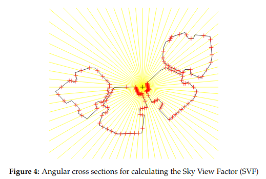
<br>Unfortunately, already the first example was not executed correctly. There has been an error using function `raster::function()` despite the namespace was specified. Due to this fact all functions with park object will be commented and thus not executed. It is often responsible for the green circle shown on the graphs of the article. Despite this fact, only two lines were interrupted and all the other code was executed perfectly.
```{r}

# Figure 5
opar = par(mfrow = c(1, 2)) 
sun_az = seq(270, 90, by = -5)
sun_elev = seq(0, 90, by = 5)
solar_pos = expand.grid(sun_az = sun_az, sun_elev = sun_elev)
solar_pos$coef = coefDirect(type = "facade", facade_az = 180, solar_pos = as.matrix(solar_pos))[1, ]
coef = reshape2::acast(solar_pos, sun_az ~ sun_elev, value.var = "coef")
image(
  180 - sun_az, sun_elev, coef,
  col = rev(heat.colors(10)),
  breaks = seq(0, 1, 0.1),
  asp = 1,
  xlab = "Facade azimuth - Sun azimuth (°)",
  ylab = "Sun elevation (°)",
  main = "Facade",
  axes = FALSE
)
box()
axis(1, at = seq(-90, 90, 30))
axis(2, at = seq(-90, 90, 30))
contour(180 - sun_az, sun_elev, coef, add = TRUE)
solar_pos$coef = coefDirect(type = "roof", facade_az = 180, solar_pos = as.matrix(solar_pos))[1, ]
coef = reshape2::acast(solar_pos, sun_az ~ sun_elev, value.var = "coef")
image(
  180 - sun_az, sun_elev, coef,
  col = rev(heat.colors(10)),
  breaks = seq(0, 1, 0.1),
  asp = 1,
  xlab = "Facade azimuth - Sun azimuth (°)",
  ylab = "Sun elevation (°)",
  main = "Roof",
  axes = FALSE
)
box()
axis(1, at = seq(-90, 90, 30))
axis(2, at = seq(-90, 90, 30))
contour(180 - sun_az, sun_elev, coef, add = TRUE)
par(opar)

# location = gCentroid(build)
# park_location = shift(location, y = 20, x = -8)
# park = gBuffer(park_location, width = 12)

```
##### Graph from the article:

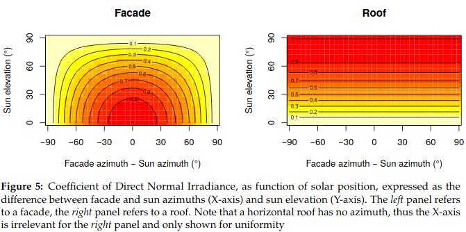

```{r}
# Figure 6
opar = par(mar = rep(0, 4))
plot(build, col = "lightgrey")
text(gCentroid(build, byid = TRUE), build$BLDG_HT)
#plot(park, col = "lightgreen", add = TRUE)
par(opar)

location = gCentroid(build)
time = as.POSIXct(
  x = "2004-12-24 13:30:00",
  tz = "Asia/Jerusalem"
)
location_geo = spTransform(
  x = location,
  CRSobj = "+proj=longlat +datum=WGS84"
)
library(maptools)
solar_pos = solarpos(
  crds = location_geo,
  dateTime = time
)
#Expected value:
#     [,1]     [,2]
#[1,] 208.7333 28.79944
solar_pos
h = shadowHeight(
  location = location,
  obstacles = build,
  obstacles_height_field = "BLDG_HT",
  solar_pos = solar_pos
)
# Expected value of h: 19,86451
h
# Expected value: 19.86451
shadowHeight(
  location = location,
  obstacles = build,
  obstacles_height_field = "BLDG_HT",
  time = time
)

```
##### Graph from the article:

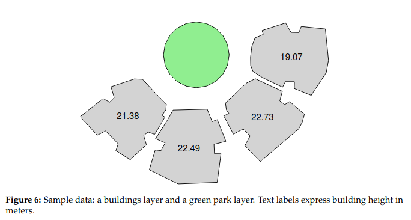
```{r}
# Figure 7
sun = shadow:::.sunLocation(
  location = location,
  sun_az = solar_pos[1, 1],
  sun_elev = solar_pos[1, 2]
)
sun_ray = ray(from = location, to = sun)
build_outline = as(build, "SpatialLinesDataFrame")
inter = gIntersection(build_outline, sun_ray)
opar = par(mar = rep(1, 4))
plot(build)
plot(sun_ray, add = TRUE, lwd = 3, col = "yellow")
plot(location, add = TRUE)
text(location, paste(round(h, 2), "m"), pos = 3)
plot(inter, add = TRUE, col = "red")
text(gCentroid(build, byid = TRUE), build$BLDG_HT)
par(opar)

ext = as(extent(build) + 50, "SpatialPolygons")
r = raster(ext, res = 2)
proj4string(r) = proj4string(build)
height_surface = shadowHeight(
  location = r,
  obstacles = build,
  obstacles_height_field = "BLDG_HT",
  solar_pos = solar_pos,
  parallel = 5
)
```
##### Graph from the article:

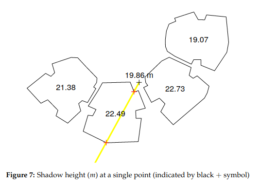

```{r}
# Figure 8
opar = par(mar = rep(1, 4))
plot(height_surface, col = grey(seq(0.9, 0.2, -0.01)), axes = FALSE, box = TRUE)
contour(height_surface, add = TRUE)
plot(build, add = TRUE, border = "red")
text(location, paste(round(h, 2), "m"), halo = TRUE, pos = 3, col = "red", font = 2)
plot(sun_ray, add = TRUE, lwd = 3, col = "yellow")
plot(inter, add = TRUE, col = "red")
plot(location, add = TRUE)
text(gCentroid(build, byid = TRUE), build$BLDG_HT)
par(opar)
```
##### Graph from the article:


```{r}

grid = surfaceGrid(
  obstacles = build,
  obstacles_height_field = "BLDG_HT",
  res = 2
)
# Expected value:
##>   build_id BLDG_HT obs_id type seg_id xy_id facade_az
#> 1      722   22.49      3 roof     NA    NA        NA
#> 2      722   22.49      3 roof     NA    NA        NA
#> 3      722   22.49      3 roof     NA    NA        NA
#> 4      722   22.49      3 roof     NA    NA        NA
#> 5      722   22.49      3 roof     NA    NA        NA
#> 6      722   22.49      3 roof     NA    NA        NA
head(grid)
#>       build_id BLDG_HT obs_id   type seg_id xy_id facade_az
#> 19610      831   19.07      4 facade     74    44  100.265
#> 19710      831   19.07      4 facade     75    45  123.6695
#> 19810      831   19.07      4 facade     75    46  123.6695
#> 19910      831   19.07      4 facade     75    47  123.6695
#> 20010      831   19.07      4 facade     75    48  123.6695
#> 20110      831   19.07      4 facade     75    49  123.6695
tail(grid)
#>         x1      x2    h
#> 1 667882.9 3538086 22.5
#> 2 667884.9 3538086 22.5
#> 3 667886.9 3538086 22.5
#> 4 667888.9 3538086 22.5
#> 5 667890.9 3538086 22.5
#> 6 667892.9 3538086 22.5
head(coordinates(grid))
s = inShadow(
  location = grid,
  obstacles = build,
  obstacles_height_field = "BLDG_HT",
  solar_pos = solar_pos
)
#> [1] 2693    1
dim(s)

```

### Inaccuracy!


```{r}
# Figure 9
library(plot3D)
opar = par(mar = rep(0, 4))
scatter3D(
  x = coordinates(grid)[, 1],
  y = coordinates(grid)[, 2],
  z = coordinates(grid)[, 3],
  theta = 55,
  colvar = s[, 1],
  col = c("yellow", "grey"),
  pch = 16,
  scale = FALSE,
  colkey = FALSE,
  cex = 1.1
)
scatter3D(
  x = coordinates(grid)[, 1],
  y = coordinates(grid)[, 2],
  z = coordinates(grid)[, 3],
  theta = 55,
  col = "black",
  pch = 1,
  lwd = 0.1,
  scale = FALSE,
  colkey = FALSE,
  cex = 1.1,
  add = TRUE
)
par(opar)

time2 = as.POSIXct(
  x = "2004-06-24 09:30:00",
  tz = "Asia/Jerusalem"
)
solar_pos2 = solarpos(
  crds = location_geo,
  dateTime = time2
)
time2 = as.POSIXct(
  x = "2004-06-24 09:30:00",
  tz = "Asia/Jerusalem"
)
solar_pos2 = solarpos(
  crds = location_geo,
  dateTime = time2
)
#>          [,1]   [,2]
#> [1,] 88.83113 46.724
solar_pos2
footprint = shadowFootprint(
  obstacles = build,
  obstacles_height_field = "BLDG_HT",
  solar_pos = solar_pos2
)
#park_shadow = gIntersection(park, footprint)
#shade_prop = gArea(park_shadow) / gArea(park)
#shade_prop
```
##### Graph from the article:

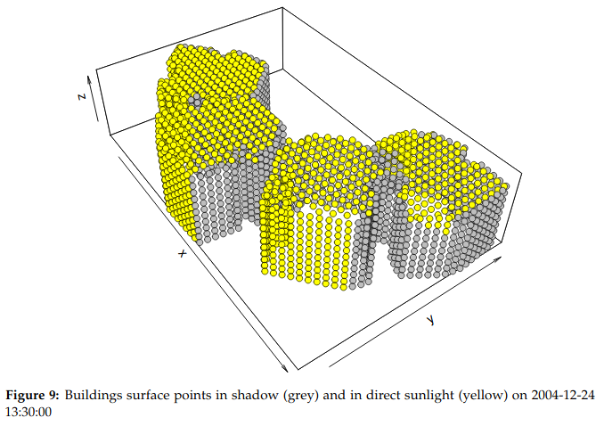

```{r}

# Figure 10
opar = par(mar = rep(0, 4))
plot(footprint, col = adjustcolor("lightgrey", alpha.f = 0.5))
plot(build, col = "darkgrey", add = TRUE)
#plot(park, col = "lightgreen", add = TRUE)
#plot(park_shadow, col = adjustcolor("darkgreen", alpha.f = 0.5), add = TRUE)
#text(gCentroid(park_shadow), round(shade_prop, 2), halo = TRUE, font = 2, cex = 1.5, col = "red")
par(opar)

time_seq = seq(
  from = as.POSIXct("2004-06-24 03:30:00", tz = "Asia/Jerusalem"),
  to = as.POSIXct("2004-06-24 22:30:00", tz = "Asia/Jerusalem"),
  by = "1 hour"
)
solar_pos_seq = solarpos(
  crds = location_geo,
  dateTime = time_seq
)
shadow_props = rep(NA, nrow(solar_pos_seq))
for(i in 1:nrow(solar_pos_seq)) {
  if(solar_pos_seq[i, 2] < 0) shadow_props[i] = 1 else {
      footprint =
        shadowFootprint(
          obstacles = build,
          obstacles_height_field = "BLDG_HT",
          solar_pos = solar_pos_seq[i, , drop = FALSE]
          )
    #park_shadow = gIntersection(park, footprint)
   # if(is.null(park_shadow))
      shadow_props[i] = 0
    #else
      #shadow_props[i] = gArea(park_shadow) / gArea(park)
    }
}
```
##### Graph from the article:

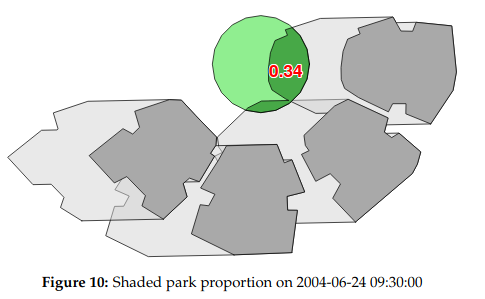
```{r cache=TRUE}
# Figure 11
plot(
  time_seq,
  shadow_props,
  xlab = "Time",
  ylab = "Shaded proportion",
  type = "b"
)
text(
  x = time_seq[7]+4000, y = shadow_props[7] + 0.07,
  label = round(shadow_props[7], 2),
  col = "red", font = 2
)

s = SVF(
  location = location,
  obstacles = build,
  obstacles_height_field = "BLDG_HT"
)
#> [1] 0.3959721
s

svf_start = Sys.time()
svf_surface = SVF(
  location = r,
  obstacles = build,
  obstacles_height_field = "BLDG_HT",
  parallel = 5
)
svf_end = Sys.time()
svf_time = svf_end - svf_start

```
##### Graph from the article:

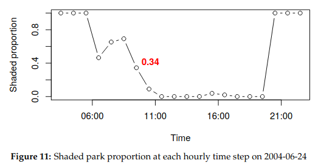
```{r, eval = TRUE, cache = FALSE}

# Figure 12
opar = par(mar = rep(1, 4))
plot(svf_surface, axes = FALSE, box = TRUE) 
contour(svf_surface, add = TRUE)
plot(build, border = "red", add = TRUE)
plot(location, add = TRUE)
text(location, round(s, 3), halo = TRUE, pos = 3, col = "red", font = 2)
```
##### Graph from the article:

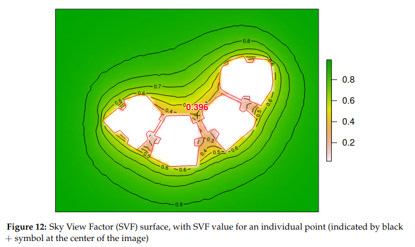
```{r}
par(opar)

#>                   time sun_az sun_elev solar_normal solar_diffuse  dbt  ws
#> 1  1999-01-01 01:00:00  66.73   -70.94            0             0  6.6 1.0
#> 2  1999-01-01 02:00:00  82.02   -58.68            0             0  5.9 1.0
#> 3  1999-01-01 03:00:00  91.00   -45.99            0             0  5.4 1.0
#> 4  1999-01-01 04:00:00  98.13   -33.32            0             0  4.9 1.0
#> 5  1999-01-01 05:00:00 104.81   -20.86            0             0  4.4 1.0
#> 6  1999-01-01 06:00:00 111.73    -8.76            0             6  4.8 1.0
#> 7  1999-01-01 07:00:00 119.41     2.91          118            24  7.3 1.0
#> 8  1999-01-01 08:00:00 128.39    13.30          572            45 11.2 1.0
#> 9  1999-01-01 09:00:00 139.20    22.46          767            57 16.0 1.0
#> 10 1999-01-01 10:00:00 152.33    29.63          809            66 16.3 2.1

head(tmy, 10)
solar_pos = as.matrix(tmy[, c("sun_az", "sun_elev")])

#>   sun_az sun_elev
#> 2  66.73   -70.94
#> 3  82.02   -58.68
#> 4  91.00   -45.99
#> 5  98.13   -33.32
#> 6 104.81   -20.86
#> 7 111.73    -8.76

head(solar_pos)

#rad_start = Sys.time()
#rad = radiation(
#  grid = grid,
#  obstacles = build,
#  obstacles_height_field = "BLDG_HT",
#  solar_pos = solar_pos,
#  solar_normal = tmy$solar_normal,
#  solar_diffuse = tmy$solar_diffuse,
#  parallel = 5
# )
#rad_end = Sys.time()
#rad_time = rad_end - rad_start

#>         svf  direct  diffuse   total
#> 1 0.9999875 1242100 473334.1 1715434
#> 2 0.9999830 1242100 473332.0 1715432
#> 3 0.9999778 1242100 473329.5 1715429
#> 4 0.9999685 1242100 473325.1 1715425
#> 5 0.9999538 1242099 473318.2 1715417
#> 6 0.9999396 1242099 473311.4 1715411

#head(rad)

```
Function `radiation()` could not be executed on my machine. It may be caused by the parameters of my hardware but it did net return any value even after working for an hour. Therefore the next chunk could not be evaluated.

```{r eval = FALSE, cache = FALSE}

# Figure 13
opar = par(mfrow=c(3, 1), oma = c(5,4,0,0) + 0.1,
          mar = c(0,0,3,3) + 0.1)
scatter3D(
  x = coordinates(grid)[, 1],
  y = coordinates(grid)[, 2],
  z = coordinates(grid)[, 3],
  colvar = rad$direct / 1000,
  scale = FALSE,
  theta = 55,
  pch = 20,
  cex = 1.35,
  clab = expression(paste("kWh / ", m^2)),
  main = "Direct radiation"
)
scatter3D(
  x = coordinates(grid)[, 1],
  y = coordinates(grid)[, 2],
  z = coordinates(grid)[, 3],
  colvar = rad$diffuse / 1000,
  scale = FALSE,
  theta = 55,
  pch = 20,
  cex = 1.35,
  clab = expression(paste("kWh / ", m^2)),
  main = "Diffuse radiation"
)
scatter3D(
  x = coordinates(grid)[, 1],
  y = coordinates(grid)[, 2],
  z = coordinates(grid)[, 3],
  colvar = rad$total / 1000,
  scale = FALSE,
  theta = 55,
  pch = 20,
  cex = 1.35,
  clab = expression(paste("kWh / ", m^2)),
  main = "Total radiation"
)

```
```{r}
par(opar)

```
##### Graph from the article:


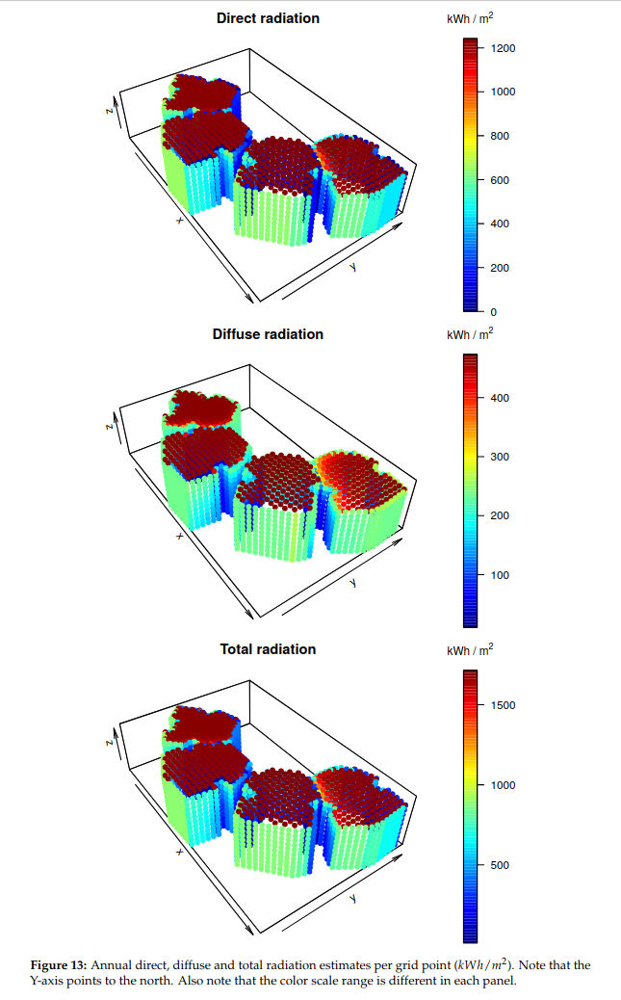


The process of reproduction did not finish with complete success but anyway most of the graphs were reproduced with details. Unfortunately, not every value was exact to the value shown in the article. Due to an error which occured in the first chunk it was impossible to continue checking functions using object `park`.

# ciuupi

ciuupi is an R package for computing confidence intervals that utilize uncertain prior information. It was published by Rheanna Mainzer and Paul Kabaila in 2018 and published by The R Journal in 2019. It requires only two packages excluding itself: nloptr and statmod.
It contains six functions. The authors provided us with the code to produce four graphs in the article and two lists of values for 'upper' and 'lower'.
```{r message = FALSE, warning = FALSE}
library("ciuupi")
library(nloptr)
library(statmod)

# Specify alpha, a, c and x.
alpha <- 0.05
a <- c(0, 2, 0, -2)
c <- c(0, 0, 0, 1)
x <- cbind(rep(1, 4), c(-1, 1, -1, 1), c(-1, -1, 1, 1), c(1, -1, -1, 1))

# Compute (b(1), b(2), ..., b(5), s(0), s(1), ..., s(5)) that specifies the CIUUPI
bsvec <- bsciuupi(alpha, a = a, c = c, x = x)
bsvec

# Compute (b(1), b(2), ..., b(5), s(0), s(1), ..., s(5)) that specifies the CIUUPI,
# given rho
bsvec2 <- bsciuupi(alpha, rho = -0.707)

# Compute the functions b and s that specify the CIUUPI on a grid of values
splineval <- bsspline(seq(0, 8, by = 0.1), bsvec, alpha)

# The first 5 values of bsvect are b(1),b(2),...,b(5).
# The last 6 values are s(0),s(1),...,s(5).
xseq <- seq(0, 6, by = 1)
bvec <- c(0, bsvec[1:5], 0)
svec <- c(bsvec[6:11], qnorm(1 - alpha/2))

# Plot the functions b and s 
plot(seq(0, 8, by = 0.1), splineval[, 2], type = "l", main = "b function",
     ylab = " ", las = 1, lwd = 2, xaxs = "i", col = "blue", xlab = "x")
points(xseq, bvec, pch = 19, col = "blue")
plot(seq(0, 8, by = 0.1), splineval[, 3], type = "l", main = "s function",
     ylab = " ", las = 1, lwd = 2, xaxs = "i", col = "blue", xlab = "x")
points(xseq, svec, pch = 19, col = "blue")

# Compute the coverage probability and scaled expected for a grid of values of gamma
gam <- seq(0, 10, by = 0.1)
cp <- cpciuupi(gam, bsvec, alpha, a = a, c = c, x = x)
sel <- selciuupi(gam, bsvec, alpha, a = a, c = c, x = x)

# Plot the coverage probability and squared scaled expected length
plot(gam, cp, type = "l", lwd = 2, ylab = "", las = 1, xaxs = "i",
     main = "Coverage Probability", col = "blue", 
     xlab = expression(paste("|", gamma, "|")), ylim = c(0.9495, 0.9505))
abline(h = 1-alpha, lty = 2)
plot(gam, sel^2, type = "l", lwd = 2, ylab = "", las = 1, xaxs = "i",
     main = "Squared SEL", col = "blue", 
     xlab = expression(paste("|", gamma, "|")), ylim = c(0.83, 1.17))
abline(h = 1, lty = 2)

# Using the vector (b(1),b(2),...,b(5),s(0),s(1),...,s(5)), compute the CIUUPI
# for this particular data
t <- 0
y <- c(87.2, 88.4, 86.7, 89.2)

# lower      upperciuupi
# -0.7710755 3.218500
ci <- ciuupi(alpha, a, c, x, bsvec, t, y, natural = 1, sig = 0.8); ci

# Compute the standard confidence interval

#  lower    upperstandard
# -1.017446 3.417446
cistandard(a = a, x = x, y = y, alpha = alpha, sig = 0.8)


```

##### Graph from the article:

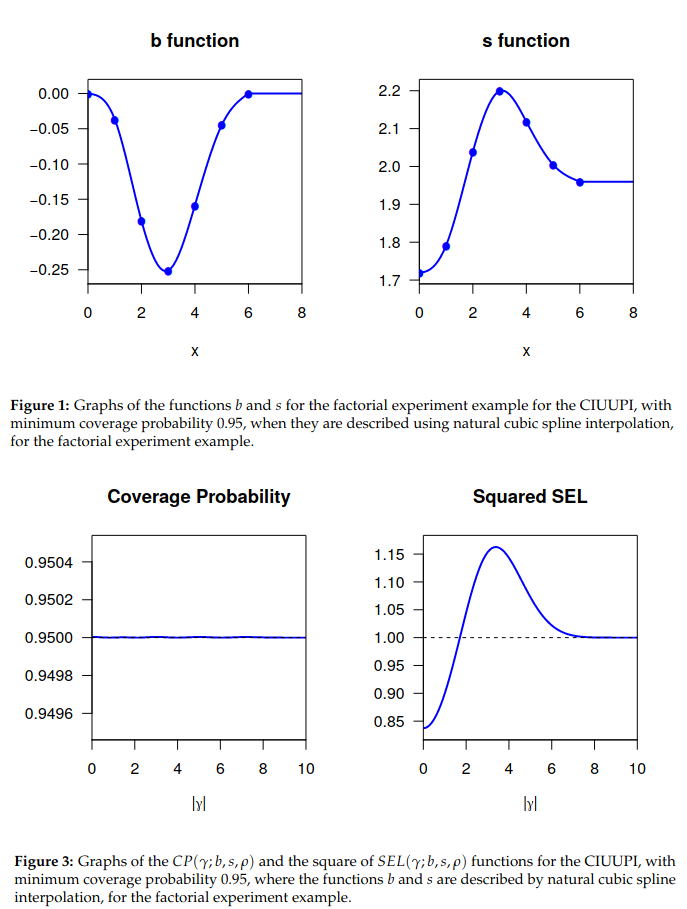

<br> Despite the time of evaluating some functions in the code as it sometimes reached a few minutes the reproduction of the article was fully successful.

# unival

unival is a R package designed to help researchers decide between unidimensional and correlated-factors solutions in the factor analysis of psychometric measures. It was created by Spanish scientists: Pere J. Ferrando, Urbano Lorenzo-Seva and David Navarro-Gonzalez and published on The R Journal in 2019. The article contains only few lines of code in the article so it is easy to fully check the reproducibilty:
```{r warning = FALSE, message = FALSE}

library(unival)
library(stats)
library(optimbase)
library(psych)
library(mirt)

```


```{r}
# replication script for unival: An FA-based R Package For Assessing Essential Unidimensionality Using External Validity Information
# 

#install.packages("unival")

library(unival)
y = SAS3f[,1]
FP = as.matrix(SAS3f[,2:4])
fg = SAS3f[,5]
PHI = cbind(c(1,0.408,0.504),c(0.408,1,0.436),c(0.504,0.436,1))

unival(y = y, FP = FP, fg = fg, PHI = PHI, type = "EAP")

remove(y, FP, fg, PHI)

```

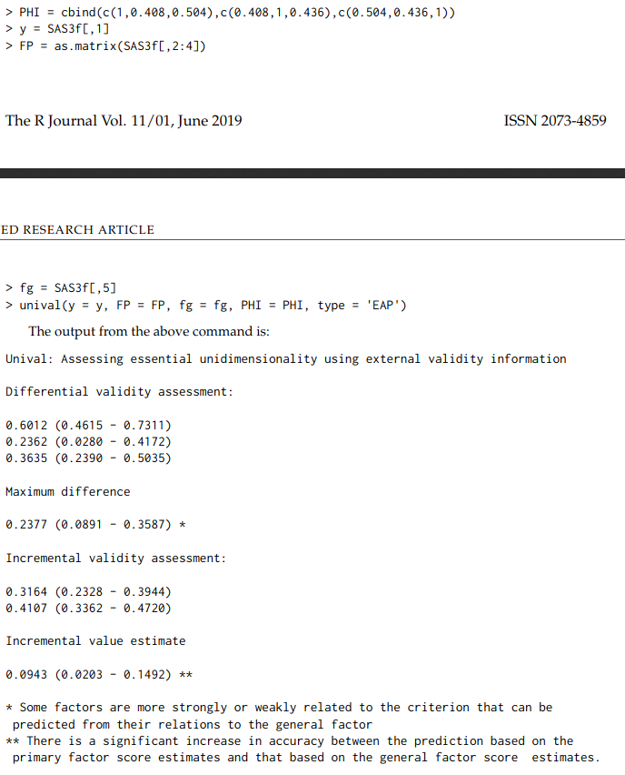

As we can see, the obtained differences were exactly the same as the authors' despite other minuends and subtrahends.

# Bibliography
1. Pere J. Ferrando, Urbano Lorenzo-Seva and David Navarro-Gonzalez, <b> unival: An FA-based R Package ForAssessing Essential UnidimensionalityUsing External Validity Information </b> https://journal.r-project.org/archive/2019/RJ-2019-040/RJ-2019-040.pdf
2. Rheanna Mainzer and Paul Kabaila, <b>ciuupi: An R package for ComputingConfidence Intervals that UtilizeUncertain Prior Information</b> https://journal.r-project.org/archive/2019/RJ-2019-026/RJ-2019-026.pdf
3. Michael Dorman, Evyatar Erell, Adi Vulkan, Itai Kloog, <b> shadow: R Package for GeometricShadow Calculations in an UrbanEnvironment </b> https://journal.r-project.org/archive/2019/RJ-2019-024/RJ-2019-024.pdf


