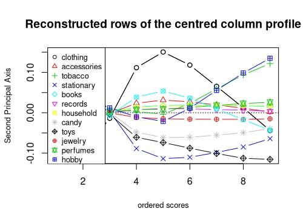
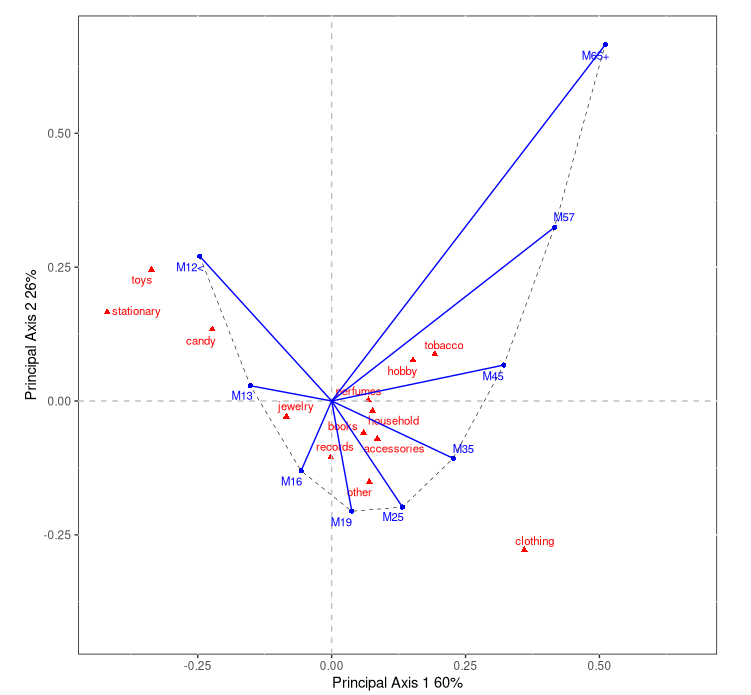
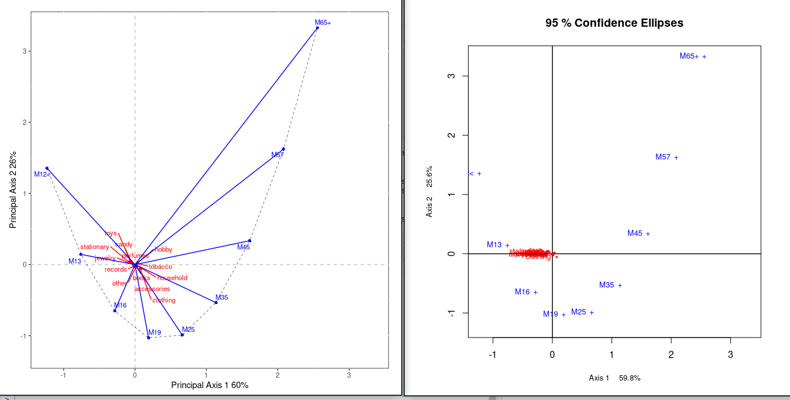

```{r setup, include=FALSE}
knitr::opts_chunk$set(echo = TRUE)
```

# Warsztaty badawcze

## Wstęp

Przyjrzymy się artykułom naukowym dotyczącym 3 pakietów: `dvn`, `CAvariance` oraz `stringdist`.

## Archiving Reproducible Research with R and Dataverse

[link do artykułu](https://journal.r-project.org/archive/2014/RJ-2014-015/RJ-2014-015.pdf)

[link do strony pakietu](https://cran.r-project.org/web/packages/dvn/index.html)

```{r dvn_try, eval=FALSE}
install.packages('dvn')
```
Pojawia się komunikat: 
```{r echo=FALSE}
print('Warning in install.packages :
  package ‘dvn’ is not available (for R version 3.6.3)')
```
Na stronie pakietu na CRANie jest sprostowanie:

Package ‘dvn’ was removed from the CRAN repository.

Formerly available versions can be obtained from the archive.

Archived on 2018-05-17 as requested by the maintainer Thomas J. Leeper <thosjleeper@gmail.com>.

Consider using package ‘dataverse’ instead.

Jak ocenić reprodukowalność? Na podstawie samego artykułu - 0. 
Jednakże jest nadzieja - jest odnośnik do pakietu `dataverse`.

```{r dataverse_try, error=TRUE}
library(dataverse)
dvSearch(list(authorName = "leeper"))
```

Niestety - przesiadka na inny pakiet wymaga użycia innych nazw funkcji. Nie jest to trudne (na przykład funkcji `dvSearch` odpowiada `dataverse_search`), ale wymaga od użytkownika czytania dokumentacji innego pakietu (a właściwie dwóch, bo trzeba porównać działanie funkcji) lub poszukania aktualniejszego artykułu naukowego. To za dużo, by uznać artykuł za reprodukowalny.


## Variants of Simple Correspondence Analysis

[link do artykułu](https://journal.r-project.org/archive/2016/RJ-2016-039/RJ-2016-039.pdf)

[link do strony pakietu](https://cran.r-project.org/web/packages/CAvariants/index.html)

```{r}
library(CAvariants)
res <- CAvariants(shopdataM, catype = "SONSCA")
names(res)
# print(res) - output się pojawia poprawny, straaaasznie długi
capture.output(print(res)) -> print_output
print(length(print_output))
# summary(res) - również działa poprawnie
capture.output(summary(res)) -> summary_output
print(length(summary_output))
# plot(res, plottype = "biplot", biptype = "row", scaleplot = 5, pos = 1)
# plot(res, scaleplot = 1, ell = TRUE, alpha = 0.05)
```

Tutaj - mamy do czynienia z małą ilością kodu do reprodukcji. Dla odmiany, tu można mówić o bardzo dobrej reprodukowalności.

Wyniki zwracane na konsolę przeciążonych funkcji `print`, `summary` i `names` się w pełni pokrywają z udostępnionymi w artykule. Pownieważ są one dość długie, nie zamieściłem ich w tym artykule.

Funkcja `plot` z kolei rysuje wykresy korzystając z pakietu `graphics`; co niespotykane, rysuje je w nowych oknach korzystając z R graphics device (trochę, jak w MATLABie). Zapisane pliki .png załączam:







W artykule wystąpił również wykres piąty, będący zbliżeniem na chmurę czerwonych punktów na wykresie czwartym. Niestety, R graphics device nie pozwalało mi w prosty sposób tego powtórzyć (nie miałem żadnego tooltipa, zwykłe skróty klawiszowe nie działały. Pomogłaby pewnie zmiana zakresu na osiach, ale to już wychodzi poza ramy reprodukowalności).

## The stringdist Package for Approximate String Matching

[link do artykułu](https://journal.r-project.org/archive/2014/RJ-2014-011/RJ-2014-011.pdf)

[link do strony pakietu](https://cran.r-project.org/web/packages/stringdist/index.html)


```{r install_stringdist, eval = FALSE}
install.packages('stringdist')
```
```{r print_stringdist, echo=FALSE}
cat('Warning messages:
1: In doTryCatch(return(expr), name, parentenv, handler) :
  display list redraw incomplete
2: In doTryCatch(return(expr), name, parentenv, handler) :
  invalid graphics state
3: In doTryCatch(return(expr), name, parentenv, handler) :
  invalid graphics state')
```

```{r stringdist, error=TRUE}
library(stringdist)
# Oczekiwane outputy w komentarzach

stringdist('foo', c('fu','bar',NA))
## [1] 2 3 NA
stringdistmatrix(c('foo','bar'), c('fu','bar',NA))
## [,1] [,2] [,3]
## [1,] 2 3 NA
## [2,] 3 0 NA
stringdist('foo', 'bar', method='lv')
stringdist('fu', 'foo', method='hamming')
## [1] Inf
stringdistmatrix(c('foo','bar'), c('fu','bar',NA), ncores=3)
amatch('fu', c('foo','bar'), maxDist=2)
## [1] 1
ain('fu', c('foo','bar'), maxDist=2)
## [1] TRUE
amatch(NA, c('foo',NA))
## [1] 2
amatch(NA, c('foo',NA), matchNA=FALSE)
## [1] NA
amatch(NA, c('foo',NA), matchNA=FALSE, nomatch=0)
## [1] 0
stringdist('Motorhead', 'Motörhead')
## [1] 1
stringdist('Motorhead', enc2utf8('Motörhead'), useBytes=TRUE)
## [1] 2
stringdist(c('foo','fu'), 'bar', method='hamming')
## [1] 3 Inf
stringdist('leia', 'leela', method='lcs')
## [1] 3
stringdist('leela', 'leia', method='lv')
## [1] 2
stringdist('leia', 'leela', method='lv', weight=c(1,0.1,1))
## [1] 2
stringdist('leia', 'leela', method='lv', weight=c(0.1,1,1))
## [1] 1.1
stringdist('leela', 'leia', method='lv', weight=c(1,0.1,1))
## [1] 1.1
stringdist('ba','ab') + stringdist('ab','acb')
## [1] 2
stringdist('ba','acb')
## [1] 3
stringdist('ba', 'acb', method='dl')
## [1] 2
stringdist('leia', 'leela', method='jaccard', q=2)
## [1] 0.8333333
stringdist('leia', 'leela', method='qgram', q=1)
## [1] 3
stringdist('leia', 'leela', method='qgram', q=2)
## [1] 5
stringdist('leia', 'leela', method='qgram', q=5)
## [1] Inf
stringdist('leia', 'leela', method='cosine', q=1)
## [1] 0.1666667
qgrams(
  x = c('foo','bar','bar'),
  y = c('fu','bar'),
  z = c('foobar'),
  q = 2 )
##   fo oo fu ob ba ar
## x  1  1  0  0  2  2
## y  0  0  1  0  1  1
## z  1  1  0  1  1  1
stringdist('leia', 'leela', method='jw')
## [1] 0.2166667
stringdist('leia', 'leela', method='jw', p=0.1)
## [1] 0.1733333
```

Werdykt: bardzo dobra reprodukowalność. Jedyny niereprodukowalny przykład (`stringdistmatrix(c('foo','bar'), c('fu','bar',NA), ncores=3)`) wyrzucił błąd, ponieważ funkcja (*już*) nie przyjmuje parametru `ncores`. Pakiet jest cały czas rozwijany i najprawdopodobniej zrezygnowano z tej funkcjonalności.

Co ciekawe, była to jedyna linijka kodu w artykule podana bez outputu.

## Podsumowanie

Ciągły rozwój pakietów pociąga za sobą ryzyko utraty reprodukowalności przez artykuły, które *notabene* tkwią w miejscu. Jak udało się nam zobaczyć, może mieć to różne formy - zmianę w działaniu funkcji czy też wyłączenie z developmentu całego pakietu i stworzenie innego w jego miejsce. Tym niemniej, przykład pakietu `CAvariance` oraz innych, poznanych podczas laboratoriów, pokazuje, że nowsze artykuły dobrze dają się reprodukować i pozwala przypuszczać, że badania nad reprodukowalnością artykułów naukowych mogą przynieść nietrywialne rezultaty.