# coxed
## Loading libraries
I had slight problems whith installing **codex**, becouse it's not done with ususal *install.packages()*, and author said nothing about it, but it is not that important.
```{r warning=FALSE, message=FALSE}
## Packages ##
library(coxed)
library(ggplot2)
library(dplyr)


## Load and prepare data ##
data(martinvanberg)
set.seed(2443)
```

## Model estimation
Works fine

```{r}
mv.surv <- Surv(martinvanberg$formdur, event = rep(1, nrow(martinvanberg)))
mv.cox <- coxph(mv.surv ~ postel + prevdef + cont + ident + rgovm + pgovno + 
                  tpgovno + minority, data = martinvanberg)

```
## Codex usage
Despite warnings works fine
```{r}
ed <- coxed(mv.cox, method = "gam", bootstrap = TRUE, B = 30)
```

## Head()
Slight differences in values

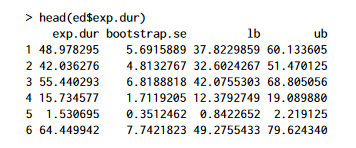

```{r}
head(ed$exp.dur)
```

## Summary() function
Slight differences in values

### Original

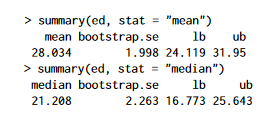

### Reproduced

```{r}
summary(ed, stat = "mean")
summary(ed, stat = "median")

```


## Codex function usage on data.frame
Rather big differences in values

### Original 

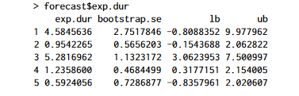
```{r warning=FALSE, message=FALSE}
new.coalitions <- data.frame(postel = c(1, 1, 1, 0, 1),
                             prevdef = c(0, 0, 1, 1, 0),
                             cont = c(1, 0, 1, 0, 1),
                             ident = c(1, 2, 2, 3, 3),
                             rgovm = c(.3, .8, 1.1, .2, .35),
                             pgovno = c(2, 3, 3, 2, 4),
                             tpgovno = c(3.2, 0, 5, 0, 2.6),
                             minority = c(0, 0, 1, 0, 0))
forecast <- coxed(mv.cox, newdata = new.coalitions, method = "gam",
                  bootstrap = TRUE, B = 30)
forecast$exp.dur

```

## Figure 1
Works fine, looks a bit different but represents the same

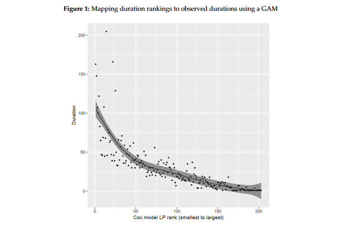

### Reproduced

```{r}


## Plot ELP rank against expected duration ##
d.mvlped <- data.frame(rank = 1:nrow(ed$gam.data), x = ed$gam.data$rank.xb, y = ed$gam.data$y, pe = ed$gam.data$gam_fit, lo = ed$gam.data$gam_fit_95lb, hi = ed$gam.data$gam_fit_95ub, failed = ed$gam.data$failed) 

ggplot(d.mvlped, aes(x = x, y = y)) + 
  geom_point(shape = 16, position = "identity", color = "black", lwd = 2) +
  geom_line(aes(x = x, y = pe), color = "black", lwd = 1) +
  geom_ribbon(aes(x = x, min = lo, max = hi), alpha = .35) +
  scale_y_continuous(limits = c(-10.2, 220), breaks = seq(0, 220, 20)) +
  scale_x_continuous(breaks = c(max(ed$gam.data$rank.xb), seq(29, 179, 25), min(ed$gam.data$rank.xb)), labels = (nrow(ed$gam.data) + 1) - c(max(ed$gam.data$rank.xb), seq(29, 179, 25), min(ed$gam.data$rank.xb)), minor_breaks = c(15, 42, 67, 92, 117, 141, 166, 191)) +
  theme(legend.position = "none", axis.text = element_text(size = 12), axis.title.y = element_text(size = 14, vjust = 1.5), axis.title.x = element_text(size = 14, vjust = -.1)) + labs(fill = "") +             
  ylab("Duration (days)") + xlab("Cox model ELP rank") 

```

## Codex again
According to warning there are some problems with the code. I tried to take a closer look, but sadly I was unable to find definite answer dose it impact the results. 

```{r}
me <- coxed(mv.cox, method = "gam", bootstrap = TRUE, B = 30,
            newdata = mutate(martinvanberg, rgovm = 0),
            newdata2 = mutate(martinvanberg, rgovm = 1.24))
```
## Summary again
Slight differences in values

### Original

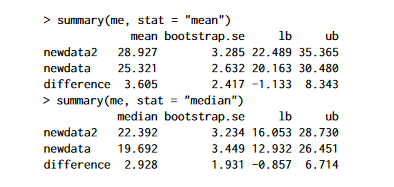

### Reproduced
```{r}
summary(me, stat = "mean")
```

```{r}
summary(me, stat = "median")
```


## Diffrences summary
* **Diffrent values**

Sometimes values vary from those in the article and in few cases it's rather big difference e.q. in *bootstrap.se* from 0,47 to 3.18. From my understanding the reason for this differences is not specified randomness, it is irritating but reproduced values are within acceptance, so the package worksfine. 

* **Diffrences in plot** 

It seems that the author did update the plot but did not update the code for it, so what I was able to reproduce is uglier version of the same picture. 

## Conclusion
The package works fine, but the author could pay a closer atention to code that he attached. I would say that becouse of slight differences between what article shows and what code outputs the article is irreproducible. Nevertheless article does not misguide users when it comes to using the package, so this irreproduciblity in my opinion is not very serious. Article or code ought to be corrected but there is no reason to put it down or take other extreme measures. 


# lpirfs
I was very happy to analize this article because autor attached all code from it. Very easly we can follow his resoults just by launching `adaemmer.R`, this is great example of an article that takes into account more that sheer content in .pdf file.
Let's follow the author then, funnily enough it starts with reproduction of results of a different author. 

## Replicating results by Jordà (2005)

### Table - Original
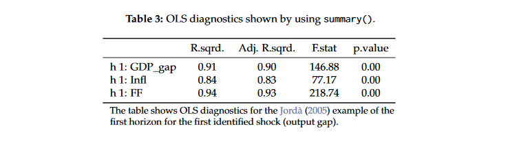

### Table - Reproduced
```{r fig11, warning=FALSE, message=FALSE}
library(lpirfs)
library(ggpubr)
library(gridExtra)

endog_data  <- interest_rules_var_data
results_lin <- lp_lin(endog_data     = endog_data,lags_endog_lin = 4,trend          = 0,shock_type     = 1,confint        = 1.96,hor            = 12)

summary(results_lin)[[1]][1]
```

### Figure 1 - Original

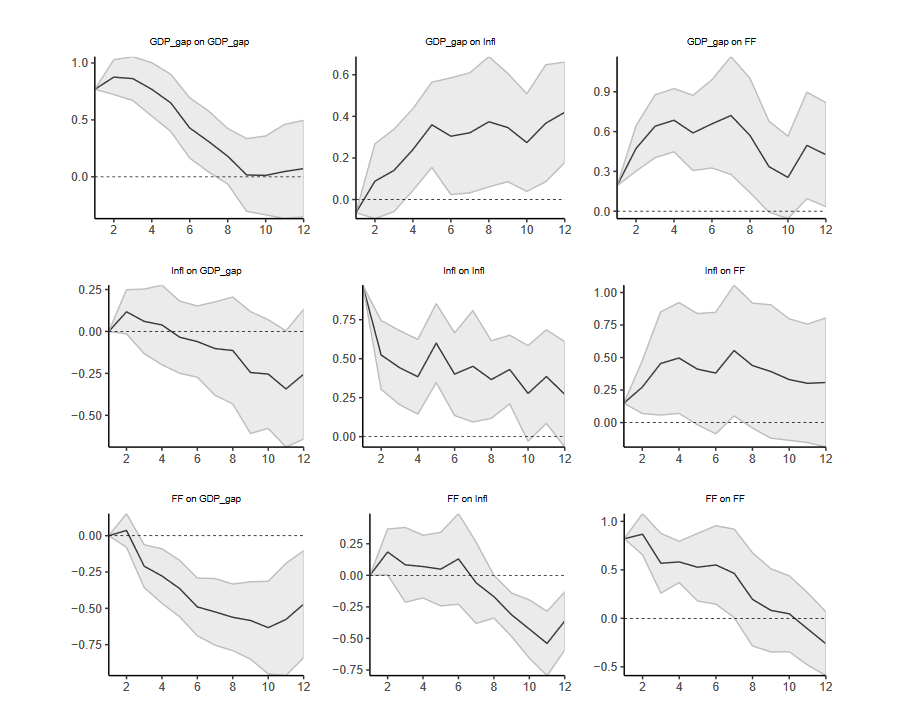

### Figure 1 - Reproduced

```{r fig12, dependson='fig11'}
plot(results_lin)
```

### Figure 2 - Original

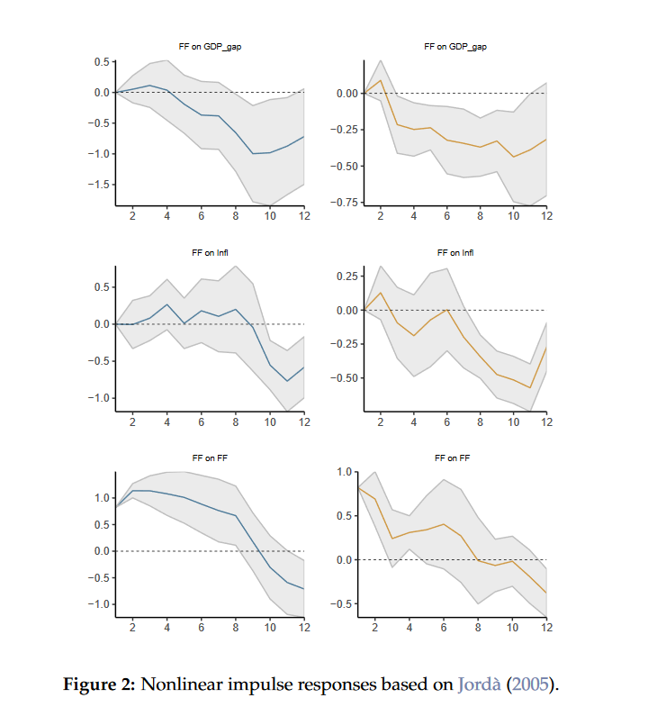

### Figure 2 - Reproduced 
**Copy from attached file**
```{r fig2, dependson='fig12'}
################################################################################ 
#                 ---  Code for Figure 2 ---
################################################################################  
 
 # Choose data for switching variable (here Federal Funds Rate)
 switching_data <-  if_else(dplyr::lag(endog_data$Infl, 3) > 4.75, 1, 0)


 # switching_data_log <-  dplyr::lag(endog_data$Infl, 3) %>%
 #                      replace_na(0)

 # Estimate model and save results
 results_nl    <- lp_nl(endog_data,
                        lags_endog_lin  = 4,
                        lags_endog_nl   = 4,
                        trend           = 0,
                        shock_type      = 0,
                        confint         = 1.96,
                        hor             = 12,
                        switching       = switching_data,
                        lag_switching   = F,
                        use_logistic    = F)


 # Use plot functions
 nl_plots <- plot_nl(results_nl)

 # Combine plots by using 'ggpubr' and 'gridExtra'
 single_plots      <- nl_plots$gg_s1[c(3, 6, 9)]
 single_plots[4:6] <- nl_plots$gg_s2[c(3, 6, 9)]

 all_plots <- sapply(single_plots, ggplotGrob)

 # Show all plots
 nl_all_plots <- marrangeGrob(all_plots, nrow = 3, ncol = 2, top = NULL)
 nl_all_plots

# --- End code for Figure 2
```


## Figure 3
### Original 

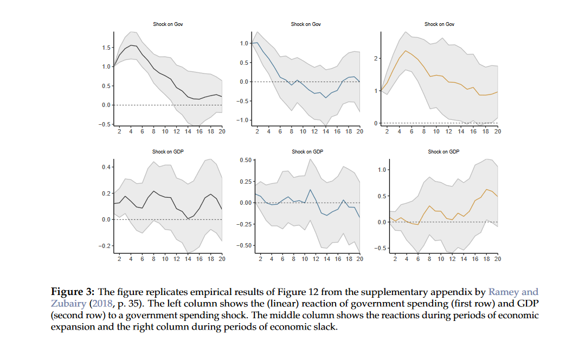

### Reproduced
**Copy from attached file**

```{r fig3, dependson='fig2'}
 
################################################################################ 
#                 ---  Code for Figure 3 ---
################################################################################  
 

# Load data
 ag_data       <- ag_data
 sample_start  <- 7
 sample_end    <- dim(ag_data)[1]

# Endogenous data
 endog_data    <- ag_data[sample_start:sample_end,3:5]

# Variable to shock with. Here government spending due to
# Blanchard and Perotti (2002) framework
 shock         <- ag_data[sample_start:sample_end, 3]

# Estimate linear model
 results_lin_iv <- lp_lin_iv(endog_data,
                             lags_endog_lin = 4,
                             shock          = shock,
                             trend          = 0,
                             confint        = 1.96,
                             hor            = 20)


# Make and save plots
 iv_lin_plots    <- plot_lin(results_lin_iv)

# This example replicates results from the Supplementary Appendix
# by Ramey and Zubairy (2018) (RZ-18).

# Load and prepare data
 ag_data           <- ag_data
 endog_data        <- ag_data[sample_start:sample_end, 3:5]

# The nonlinear shock is estimated by RZ-18.
 shock             <- ag_data[sample_start:sample_end, 7]

# Include four lags of the 7-quarter moving average growth rate of GDP
# as exogenous variables (see RZ-18)
 exog_data         <- ag_data[sample_start:sample_end, 6]

# Use the 7-quarter moving average growth rate of GDP as switching variable
# and adjust it to have suffiently long recession periods.
 switching_variable <- ag_data$GDP_MA[sample_start:sample_end] - 0.8

# Estimate local projections
 results_nl_iv <- lp_nl_iv(endog_data,
                           lags_endog_nl     = 3,
                           shock             = shock,
                           exog_data         = exog_data,
                           lags_exog         = 4,
                           trend             = 0,
                           confint           = 1.96,
                           hor               = 20,
                           switching         = switching_variable,
                           use_hp            = FALSE,
                           gamma             = 3)

# Make and save plots
 plots_nl_iv <- plot_nl(results_nl_iv)

# Make to list to save all plots
 combine_plots <- list()

# Save linear plots in list
 combine_plots[[1]] <- iv_lin_plots[[1]]
 combine_plots[[2]] <- iv_lin_plots[[3]]

# Save nonlinear plots for expansion period
 combine_plots[[3]] <- plots_nl_iv$gg_s1[[1]]
 combine_plots[[4]] <- plots_nl_iv$gg_s1[[3]]

# Save nonlinear plots for recession period
 combine_plots[[5]] <- plots_nl_iv$gg_s2[[1]]
 combine_plots[[6]] <- plots_nl_iv$gg_s2[[3]]

 lin_plots_all     <- sapply(combine_plots, ggplotGrob)
 combine_plots_all <- marrangeGrob(lin_plots_all, nrow = 2, ncol = 3, top = NULL)
 combine_plots_all

 # --- End code for Figure 3
```


## Figure 4
### Original

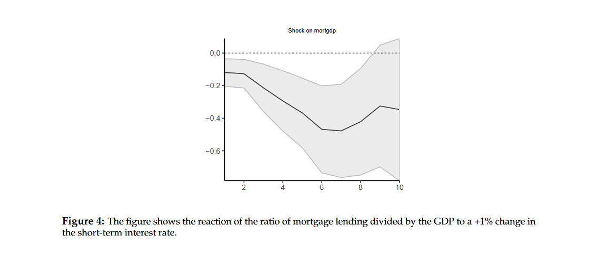

### Reproduced
**Copy from attached file**

```{r fig4, dependson='fig3', warning=FALSE, message=FALSE}

################################################################################ 
#                 ---  Code for Figure 4 ---
################################################################################  
 
# Load necessary libraries
  library(httr)
  library(readxl)
  library(dplyr)
 
# Retrieve the external JST Macrohistory Database
  url_jst <-"http://www.macrohistory.net/JST/JSTdatasetR3.xlsx"
  GET(url_jst, write_disk(jst_link <- tempfile(fileext = ".xlsx")))
  jst_data <- read_excel(jst_link, 2L)
 
# Swap the first two columns 
  jst_data <- jst_data                    %>%
              dplyr::filter(year <= 2013) %>%
              dplyr::select(country, year, everything())
 
# Prepare variables
  data_set <- jst_data %>%
             mutate(stir    = stir)                         %>%
             mutate(mortgdp = 100*(tmort/gdp))              %>%
             mutate(hpreal  = hpnom/cpi)                    %>%
             group_by(country)                              %>%
             mutate(hpreal  = hpreal/hpreal[year==1990][1]) %>%
             mutate(lhpreal = log(hpreal))                  %>%
   
             mutate(lhpy    = lhpreal - log(rgdppc))        %>%
             mutate(lhpy    = lhpy - lhpy[year == 1990][1]) %>%
             mutate(lhpreal = 100*lhpreal)                  %>%
             mutate(lhpy    = 100*lhpy)                     %>%
             ungroup()                                      %>%
   
             mutate(lrgdp   = 100*log(rgdppc))              %>%
             mutate(lcpi    = 100*log(cpi))                 %>%
             mutate(lriy    = 100*log(iy*rgdppc))           %>%
             mutate(cay     = 100*(ca/gdp))                 %>%
             mutate(tnmort  = tloans - tmort)               %>%
             mutate(nmortgdp = 100*(tnmort/gdp))            %>%
             dplyr::select(country, year, mortgdp, stir, ltrate, 
                                                    lhpy, lrgdp, lcpi, lriy, cay, nmortgdp)
 
 
# Exclude observations from WWI and WWII
  data_sample <- seq(1870, 2016)[which(!(seq(1870, 2016) %in%
                                            c(seq(1914, 1918), 
                                            seq(1939, 1947))))]
 
# Estimate linear panel model
  results_panel <- lp_lin_panel(data_set  = data_set,  data_sample  = data_sample,
                                endog_data        = "mortgdp", cumul_mult   = TRUE,
                                shock             = "stir",    diff_shock   = TRUE,
                                panel_model       = "within",  panel_effect = "individual",
                                robust_cov        = "vcovSCC", c_exog_data  = "cay",
                                c_fd_exog_data    = colnames(data_set)[c(seq(4,9),11)],
                                l_fd_exog_data    = colnames(data_set)[c(seq(3,9),11)],
                                lags_fd_exog_data = 2,      confint      = 1.67,
                                hor               = 10)
 
# Create and plot irfs
  plot_lin_panel <- plot_lin(results_panel)
  plot(plot_lin_panel[[1]])
 

# --- End code for Figure 4
  
```


## Figure 5
### Original

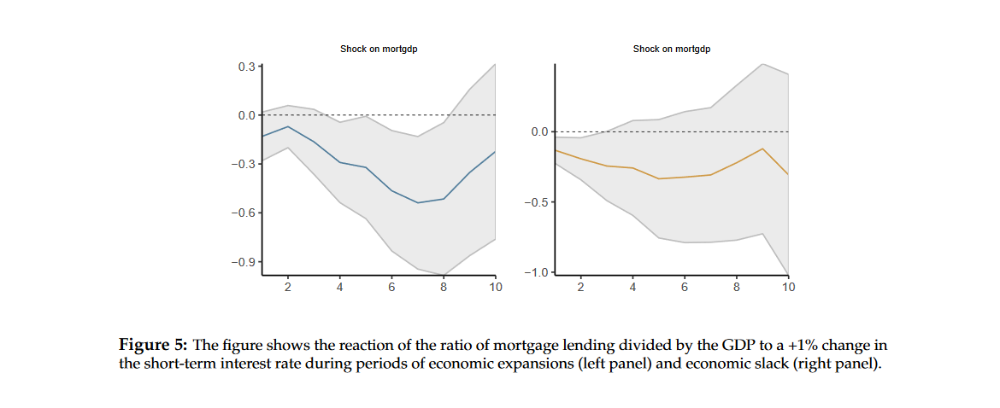

### Reproduced
**Copy from attached file**

```{r fig5, dependson='fig4'}
  
################################################################################ 
#                 ---  Code for Figure 5 ---
################################################################################  
  
  
# Estimate panel model
 results_panel <- lp_nl_panel(data_set          = data_set,  
                              data_sample       = data_sample,
                              endog_data        = "mortgdp", cumul_mult     = TRUE,
                              shock             = "stir",    diff_shock     = TRUE,
                              panel_model       = "within",  panel_effect   = "individual",
                              robust_cov        = "vcovSCC", switching      = "lrgdp",
                              lag_switching     = TRUE,      use_hp         = TRUE,
                              lambda            = 6.25,      gamma          = 10,
                              c_exog_data       = "cay",     
                              c_fd_exog_data    = colnames(data_set)[c(seq(4,9),11)],
                              l_fd_exog_data    = colnames(data_set)[c(seq(3,9),11)], 
                              lags_fd_exog_data = 2,      
                              confint           = 1.67,
                              hor               = 10)
 
# Create and show linear plots
  nl_plots      <- plot_nl(results_panel)
  combine_plots <- list(nl_plots$gg_s1[[1]], nl_plots$gg_s2[[1]])
  nonlinear_panel_plots <- marrangeGrob(combine_plots, nrow = 1, ncol = 2, top = NULL)
  nonlinear_panel_plots
  

# --- End code for Figure 5
```

**Important comment**
There are 3 more figures shown in the article after the summary, they cannot be found in provided code, but as author states. All code can be found in the [vigette](https://cran.r-project.org/web/packages/lpirfs/vignettes/lpirfs_vignette.html) of the package.


## Conclusion 
Reproduction process of this article was mostly based on recreating shown figures and thanks to the code provided by author this was very easy and pleasent. Of course recreated figures differ in size and proportions, but this is vaery hard to improve for everyone. Resoults are 100% the same, this article is as reprodcible as it gets.


# MANOVA.RM


## Example 1

### Original

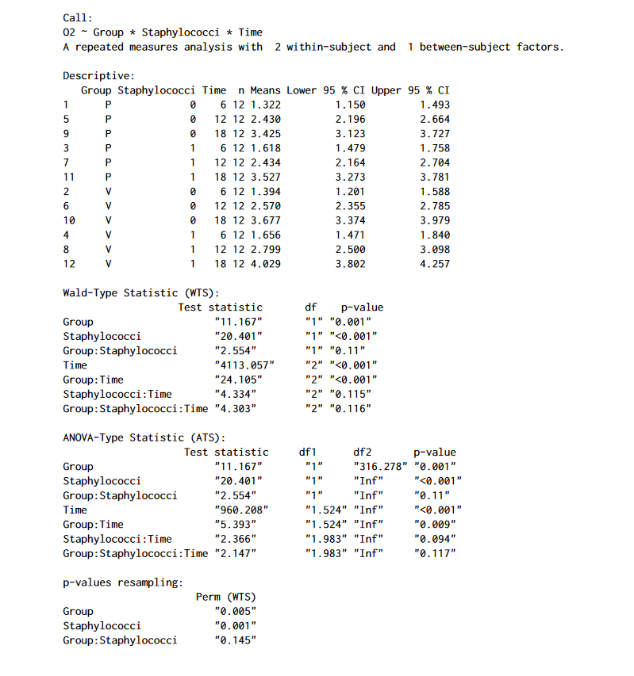


### Reproduced
**Copy from attached file**

```{r warning=FALSE}
detach("package:ggplot2", force = TRUE)
detach("package:ggpubr", force = TRUE)
detach("package:gridExtra", force = TRUE)
library(MANOVA.RM)

# Example 1
data("o2cons")
model1 <- RM(O2 ~ Group * Staphylococci * Time, data = o2cons, 
	       subject = "Subject",  no.subf = 2, iter = 1000, 
               resampling = "Perm", seed = 1234)
summary(model1)
```


## Example 2

### Original

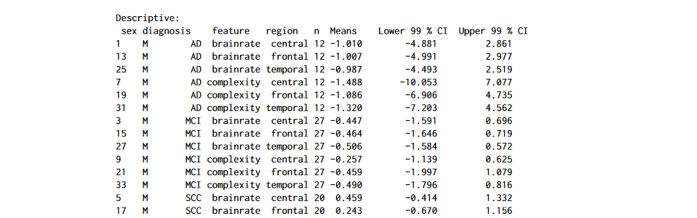

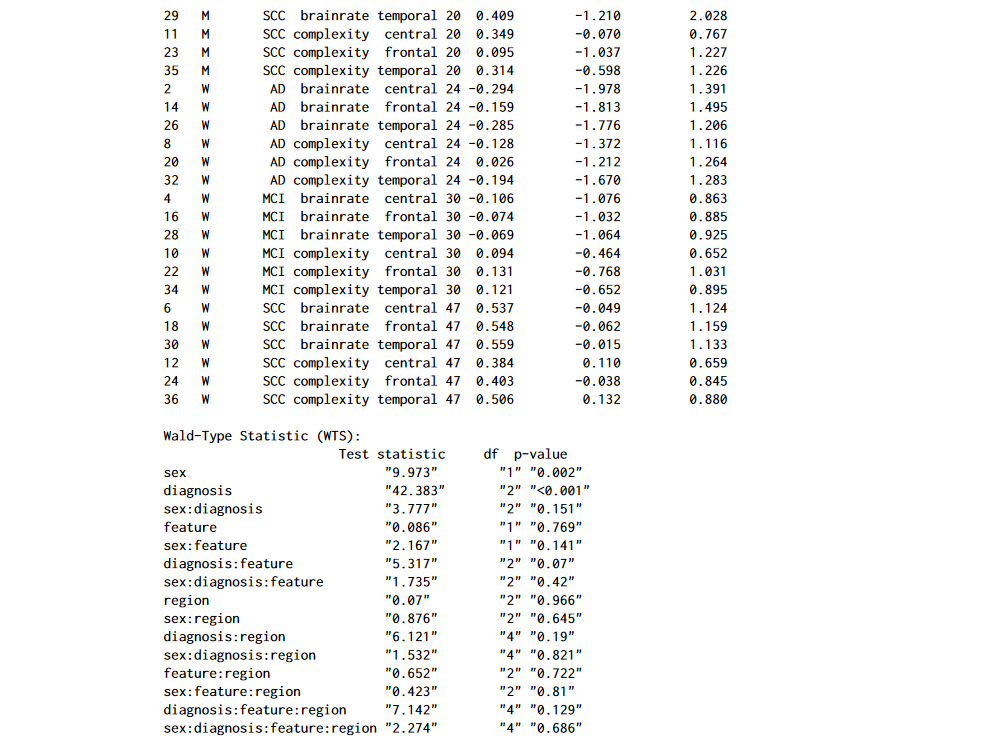


### Reproduced
**Copy from attached file**
```{r cache = TRUE}
# Example 2
data("EEG")
EEG_model <- RM(resp ~ sex * diagnosis * feature * region, 
                data = EEG, subject = "id", no.subf = 2, resampling = "WildBS",
                iter = 1000,  alpha = 0.01, CPU = 4, seed = 123)
summary(EEG_model)
```


## Plotting

### Plot 1 - Original

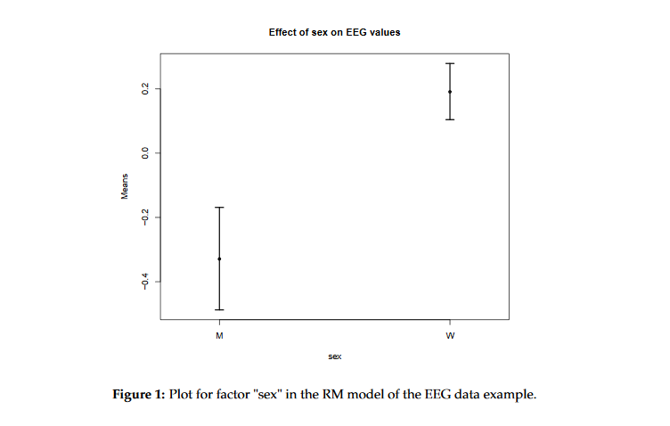

### Plot 1 - Reproduced
**Copy from attached file**
```{r}
plot(EEG_model, factor = "sex", main = "Effect of sex on EEG values")
```

### Plot 2 - Original

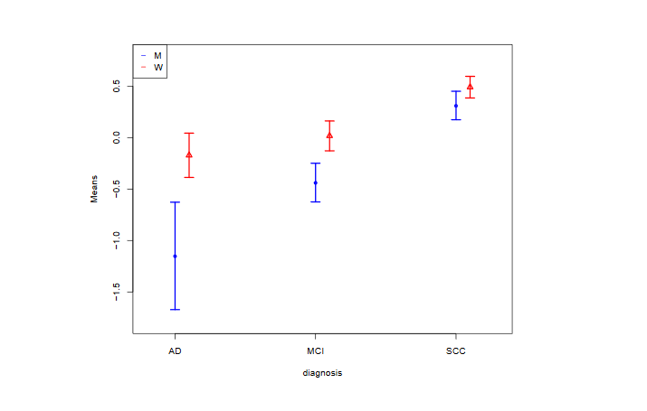

### Plot 2 - Reproduced
**Copy from attached file**
```{r}
plot(EEG_model, factor = "sex:diagnosis", legendpos = "topleft", col = c(4, 2), ylim =c(-1.8, 0.8), CI.info = TRUE)
```

### Plot 1 - Original

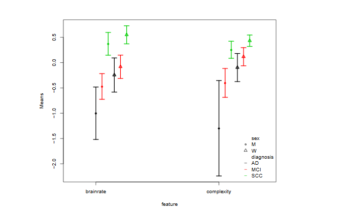

### Plot 1 - Reproduced
**Copy from attached file**
```{r}
plot(EEG_model, factor = "sex:diagnosis:feature", legendpos = "bottomright", gap = 0.05)
```


## MANOVA

### Original


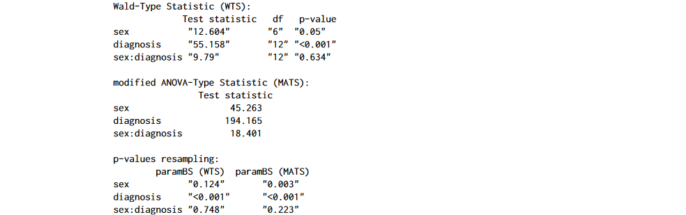


### Reproduced
**Copy from attached file**
```{r cache = TRUE}
data("EEG")
EEG_MANOVA <- MANOVA(resp ~ sex * diagnosis, data = EEG,
	               subject = "id", resampling = "paramBS", 
	               iter = 1000,  alpha = 0.01, CPU = 1, seed = 987)
summary(EEG_MANOVA)
```


## MANOVA wide

### Original

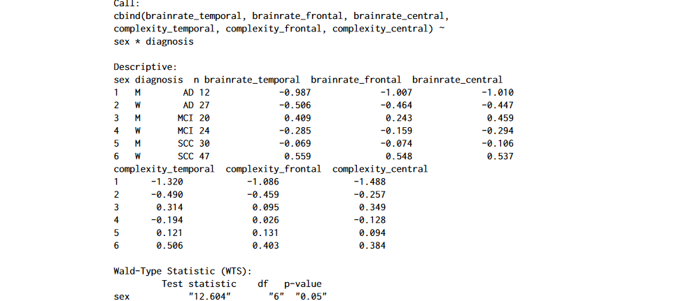


### Reproduced
**Copy from attached file**
```{r}
data("EEGwide")
EEG_wide <- MANOVA.wide(cbind(brainrate_temporal, brainrate_frontal, brainrate_central, complexity_temporal, complexity_frontal, complexity_central) ~ sex * diagnosis,
                        data = EEGwide,
                        resampling = "paramBS", 
                        iter = 1000,  alpha = 0.01, CPU = 1, seed = 987)
summary(EEG_wide)
```


## Confidence Regions

### Original


### Reproduced
**Copy from attached file**
```{r}
library(HSAUR)
data(water)
test <- MANOVA.wide(cbind(mortality, hardness) ~ location, data = water, iter = 1000, resampling = "paramBS", CPU = 1, seed = 123)
summary(test)
cr <- conf.reg(test)
```

### Plot - Original

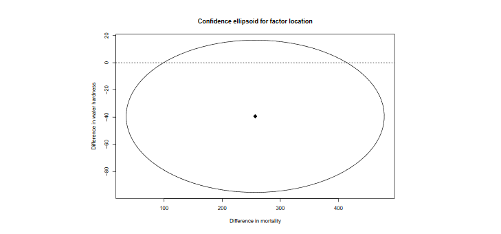

### Plot - Reproduced
**Copy from attached file**
```{r}
plot(cr, xlab = "Difference in mortality", ylab ="Difference in water hardness")
```


## Nested design

### Original


### Reproduced
**Copy from attached file**
```{r warning=FALSE}
# nested design
library(GFD)
data(curdies)
set.seed(123)
curdies$dug2 <- curdies$dugesia + rnorm(36)

# first possibility: MANOVA.wide
fit1 <- MANOVA.wide(cbind(dugesia, dug2) ~ season + season:site, data = curdies, iter = 1000, nested.levels.unique = TRUE, seed = 123, CPU = 1)

# second possibility: MANOVA (long format)
dug <- c(curdies$dugesia, curdies$dug2)
season <- rep(curdies$season, 2)
site <- rep(curdies$site, 2)
curd <- data.frame(dug, season, site, subject = rep(1:36, 2))

fit2 <- MANOVA(dug ~ season + season:site, data = curd, subject = "subject", nested.levels.unique = TRUE, seed = 123, iter = 1000, CPU = 1)

# comparison of results
summary(fit1)
summary(fit2)
```


## Post-hoc comparisons

### Original

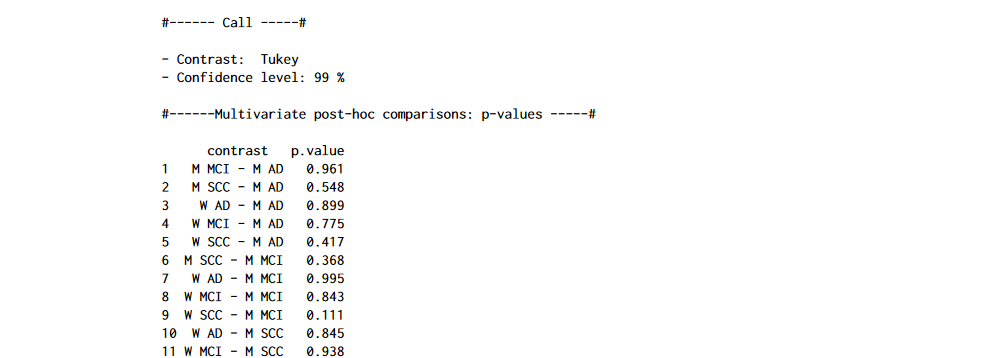


### Reproduced
**Copy from attached file**
```{r}
# pairwise comparison using Tukey contrasts
simCI(EEG_MANOVA, contrast = "pairwise", type = "Tukey")
```

### Original

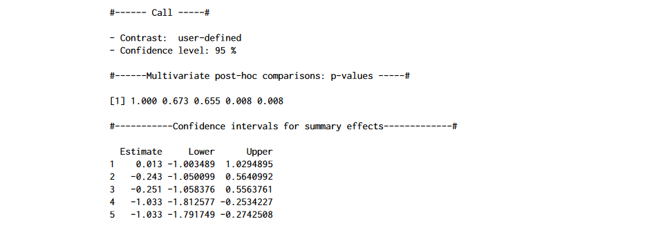

### Reproduced
**Copy from attached file**
```{r}
oneway <- MANOVA.wide(cbind(brainrate_temporal, brainrate_central) ~ diagnosis, data = EEGwide,
                      iter = 1000, CPU = 1)
# a user-defined contrast matrix
H <- as.matrix(cbind(rep(1, 5), -1*Matrix::Diagonal(5)))
simCI(oneway, contrast = "user-defined", contmat = H)
```


### Original


### Reproduced
**Copy from attached file**
```{r}
EEG1 <- MANOVA.wide(brainrate_temporal ~ diagnosis, data = EEGwide, iter = 1000, seed = 987, CPU = 1)
EEG2 <- MANOVA.wide(brainrate_central ~ diagnosis, data = EEGwide, iter = 1000, seed = 987, CPU = 1)
p.adjust(c(EEG1$resampling[, 2], EEG2$resampling[, 2]), method = "bonferroni")
```


## Conclusion

Despite code provided by author being a bit chaoic all values shown in article can be perfectly reproduced. Becouse of it I mark this article as fully reproducable. 


