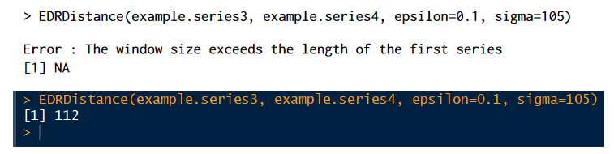

```{r setup, include=FALSE}
knitr::opts_chunk$set(echo = TRUE)
```

## Introduction
In following paragraphs will be reviewed the attempt to reproduce snippet of code included in 3 articles from
**_Journal of Statistical Software_** and **_The R Journal_**. All mentioned articles are losely connected, pertaining to approaching time series, submitted and published in span of last 15 years.
Only unexpected behaviour of analyzed code will be commented.


## pdc: An R Package for Complexity-Based Clustering of Time Series
[Article by Andreas M. Brandmaier (2015)](https://www.jstatsoft.org/article/view/v067i05)


```{r prep1, warning=FALSE, message=FALSE}
library(pdc)
library("TSclust")
library("plotrix")
```

```{r art1.1}

set.seed(69266)
grp1 <- replicate(5, arima.sim(n = 500, list(
  ar = c(0.8897, -0.4858), ma = c(-0.2279, 0.2488)), sd = sqrt(0.1796)))
grp2 <- replicate(5, arima.sim(n = 500, list(
  ar = c(-0.71, 0.18), ma = c(0.92, 0.14)), sd = sqrt(0.291)))
X <- cbind(grp1, grp2)

clustering <- pdclust(X)
clustering


truth.col <- rep(c("red", "blue"), each = 5)
plot(clustering, cols = truth.col)

cutree(clustering, k = 2)

loo1nn(clustering, truth.col)

mine <- entropyHeuristic(X, t.max = 8)
summary(mine)


plot(mine) 
```

During reproducing plot R was unable to generate by default additional white grid present on graphics enclosed to a paper. Probably reason for that is simply how default values of parameters for rgraphics functions differ over the years.

```{r art1.2}

data("paired.tseries", package = "TSclust")
truth <- rep(1:18, each = 2)
clust <- pdclust(paired.tseries)
plot(clust, timeseries.as.labels = FALSE,
     labels = names(colnames(paired.tseries)))


merges <- clust$merge[apply(clust$merge < 0, 1, all), ]
merges <- merges[(abs(merges[, 1] - merges[, 2]) == 1), ]
merges <- -merges[(merges[, 1] %% 2 == 1), ]
num.labels <- length(clust$labels)
Q <- nrow(merges) * 2 / num.labels
cat("Q = ", round(Q, 2), "\n")


methods <- c("DWT", "COR", "PACF", "ACF", "CID", "PDC")
D.list <- lapply(methods, function(x) diss(t(paired.tseries), x))
acc <- data.frame(t(sapply(D.list, loo1nn, truth)))
names(acc) <- methods
round(acc, 1)


tmp <- tempdir()
files.A <- paste(tmp, "setA.zip", sep = "/")
files.B <- paste(tmp, "setB.zip", sep = "/")
download.file("http://ntsa.upf.edu/system/files/download/Z.zip", files.A)
download.file("http://ntsa.upf.edu/system/files/download/O.zip", files.B)
instances.each <- 10
X <- matrix(NA, nrow = 4097, ncol = instances.each * 2)
for (i in 1:instances.each) {
  z <- unz(files.A, paste("Z", formatC(i, width = 3, flag = "0"), ".txt",
                          sep = ""))
  X[, i] <- as.numeric(readLines(z))
  close(z)
  z <- unz(files.B, paste("O", formatC(i, width = 3, flag = "0"), ".txt",
                          sep = ""))
  X[, instances.each + i] <- as.numeric(readLines(z))
  close(z)
  }
colnames(X) <- rep(c("closed", "close"), each = instances.each)

mine <- entropyHeuristic(X, t.max = 10)
clust <- pdclust(X)
cols <- rep(c("red", "blue"), each = instances.each)
plot(mine)
plot(clust, cols = cols)


methods <- c("DWT", "COR", "PACF", "ACF", "CID", "PDC")
D.list <- lapply(methods, function(x) diss(t(X), x))
acc <- data.frame(t(sapply(D.list, loo1nn, cols)))
names(acc) <- methods
acc


data("star.shapes", package = "pdc")
oldpar <- polar.plot(star.shapes[, 1])
par(oldpar)
ent <- entropyHeuristic(star.shapes, t.min = 5, t.max = 10)
clust <- pdclust(star.shapes, m = ent$m, t = ent$t)
truth <- sapply(colnames(star.shapes), function(x) substr(x, 1, 1))
loo1nn(clust, truth)
str(clust)


data("star.shapes.raw", package = "pdc")
rasterPlot(clust, star.shapes.raw$images, aspect = 0.5)
```

Difference between plots generated by snippets of code in article by the time of publishing and by running the code now is limited to colours.JPG graphics here and later with another plot incorporating outsourced pictures presented monochromatic pictures.

```{r art1.3}
data("complex.shapes", package = "pdc")
ent <- entropyHeuristic(complex.shapes, t.min = 5, t.max = 10)
summary(ent)


clust <- pdclust(complex.shapes, m = ent$m, t = ent$t)
truth <- rep(c("fish", "bottle", "glasses"), c(5, 4, 5))
loo1nn(clust, truth)
data("complex.shapes.raw", package = "pdc")
rasterPlot(clust, complex.shapes.raw$images)

mdsPlot(clust, truth, col = c("lightgray", "lightblue", "lightgreen"))

```

Colours used to fiil in shapes on plot above may differ as a consequence of default graphics parameters for specific version of R.

##Algorithms for Linear Time Series Analysis: With R Package
[A. Ian McLeod, Hao Yu, Zinovi L. Krougly (2007)](https://www.jstatsoft.org/article/view/v023i05)

```{r prep2}
library("ltsa")
```


```{r art2.1, results="hide"}

phi <- 0.8
n <- 1000
r <- (1 / (1 - phi^2)) * phi^(0:(n-1))
G <- toeplitz(r)
Gi <- TrenchInverse(G)
id <- matrix(0, nrow=n, ncol=n)
diag(id) < -1
max(abs(id - G%*%Gi))

```

```{r art2.2, echo=FALSE}
max(abs(id - G%*%Gi))
```

Returned value does not concur with the one given in article. However, if we modify line

```diag(id) < -1```

and run code with

```diag(id) <- 1``` instead, value is still incorrect (8.7036e-16), but in correct order of magnitude.

With ```diag <- -1``` value (2) once again does not concur with order of magnitude of result presented in the paper.


```{r art2.3.0, echo=FALSE}
w1 <- 0
```

```{r art2.3}
n <- 200
m <- 2
maxLead <- 3
N <- n +m
phi <- 0.9
r <- phi^seq(0, N + maxLead - w1)
set.seed(19890824)
z <- DLSimulate(N, r)
out <- TrenchForecast(z, r, 0.0, n, maxLead)
out$Forecasts
outer(z[n:N],phi^(1:maxLead))
```

In presented snippet is used variable ```w1```, which is used only once in article, and never defined or introduced.
Upon removing this variable, code start producing expected output.
However, precision of values in first column of presented tables in article is slightly lower.
In output of given code every value share the same degree of precision.


Following snippet of code is dependent on package FGN no longer available for R, hence expected output cannot be reproduced.

```
m <- 10^4
r < -FGNAcf(1:m, 0.84)
1 - DLAcfToAR(r)[,3][m]

data("NileMin")
out < -FitFGN(NileMin)
out

coef(out)

plot(out)
qqnorm(resid(out))

```


##Distance Measures for Time Series in R:The TSdist Package
[Usue Mori, Alexander Mendiburu and Jose A. Lozano (2016)](https://journal.r-project.org/archive/2016/RJ-2016-058/index.html)

```{r prep3, warning=FALSE, message=FALSE}
library(TSdist)
data("example.series1")
data("example.series2")
data("example.series3")
data("example.series4")
data("example.database")
data("example.database2")
data("example.database3")
data("zoo.series1")
data("zoo.series2")
data("zoo.database")

set.seed(100)
trainindex <- sample(1:100, 30, replace=FALSE)
train <- example.database2[[1]][trainindex, ]
test <- example.database2[[1]][-trainindex, ]
trainclass <- example.database2[[2]][trainindex]
testclass <- example.database2[[2]][-trainindex]

data <- example.database3$data
ground.truth <- example.database3$classes
```


```{r art3.1}

CCorDistance(example.series1, example.series2)

CorDistance(example.series1, example.series2)

EDRDistance(example.series1, example.series2, epsilon=0.1)

ERPDistance(example.series1, example.series2, g=0)

EuclideanDistance(example.series3, example.series4)

EDRDistance(example.series3, example.series4, epsilon=0.1, sigma=105)
```

Instead expected error from article function ```EDRDistance``` produces standard output

```{r art3.2}

TSDistances(example.series1, example.series2, distance="ccor")

TSDistances(example.series1, example.series2, distance="cor")

TSDistances(example.series1, example.series2, distance="edr", epsilon=0.1)

TSDistances(example.series1, example.series2, distance="erp", g=0)

TSDistances(zoo.series1, zoo.series2, distance="cor")

TSDistances(zoo.series1, zoo.series2, distance="dtw", sigma=10)

dist(example.database, method="TSDistances", distance="tquest",
     tau=mean(example.database), diag=TRUE, upper=TRUE)

TSDatabaseDistances(example.database, distance="tquest",
                    tau=mean(example.database))

TSDatabaseDistances(zoo.database, distance="tquest",
                    tau=mean(zoo.database))

TSDatabaseDistances(example.database, zoo.database, distance="tquest",
                    tau=mean(zoo.database))


OneNN(train, trainclass, test, "euclidean")
OneNN(train, trainclass, test, "tquest", tau=85)
OneNN(train, trainclass, test, testclass, "acf")$error
OneNN(train, trainclass, test, testclass, "tquest", tau=85)$error
```
Use of instructions from documentation of ```OneNN``` function did not provided seed necessary to recreate division crucial to reproduce values returned by 4 executions of function above.

```{r art 3.3}
OneNN(train, trainclass, test, testclass, "euclidean")$error

OneNN(train, trainclass, test, testclass, "dtw", sigma=20)$error

KMedoids(data, 5, "euclidean")
KMedoids(data, 5, "tquest",tau=0)
KMedoids(data, 5, ground.truth, "euclidean")$F
KMedoids(data, 5, ground.truth, "acf")$F
KMedoids(data, 5, ground.truth, "tquest", tau=0)$F
KMedoids(data, 5, ground.truth, "dtw", sigma=20)$F

```


##Conlusions
Reproducing code can prove difficult for multiple reason, including but not limiting to: outdating packages, tools and dependecies, updating packages, tools and dependecies and not providing sufficient input.
However, in certain conditions even despite mentioned problems output of code in article can be reproduced.

##Afterthoughts 
Considering informal structure of this document napiszę, że kiedy wybierałem artykuł z 2007 liczyłem, że nie będzie reprodukowalny w związku z porzuceniem prac nad użytymi pakietami, lub wręcz przeciwnie - ich dynamicznym rozwijaniem przez lata.
Nie spodziewałem się, że można go będzie uznać za niereprodukowalny przez literówki.

Dodatkowo...
Kiedy reprodukujesz artykuł i linijka kodu, która miała zwracać błąd, stwierdza, że i tak jej nie zdebugujesz, więc sama dzwoni pod 112

