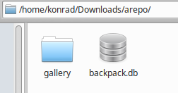
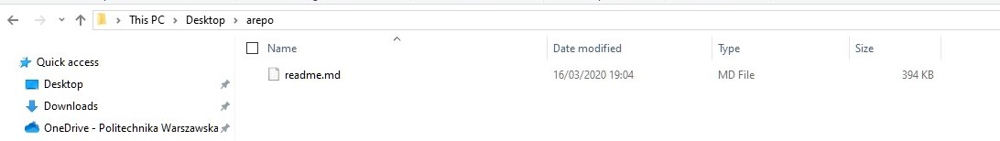
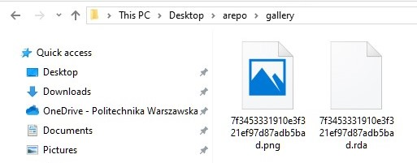
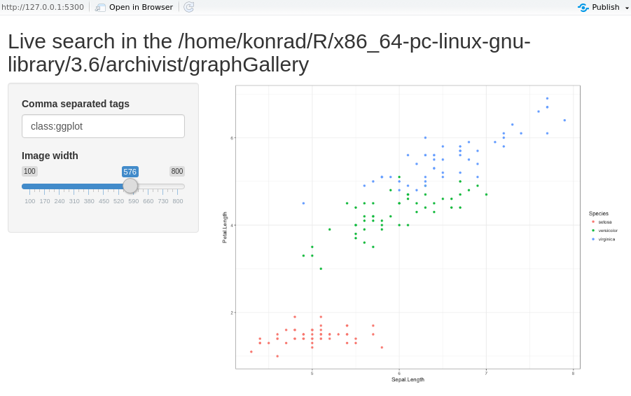

# Załączamy pakiet

```{r warnings=FALSE}
library(archivist)
```


# Zarządzanie repozytoriami

## Tworzenie nowego repozytorium

```{r mesage=FALSE}
repo <- "arepo"
createLocalRepo(repoDir = repo, default = TRUE, force=TRUE)
```

Wynik polecenia:

```{r warnings=FALSE, echo=FALSE}

```
Repozytorium rzeczywiście powstaje.


## Usuwanie stworzonego repozytorium

Usuwamy przed chwilą stworzone repozytorium:
```{r}
deleteLocalRepo(repoDir = repo)
```

```{r warnings=FALSE, echo=FALSE}

```

## Kopiowanie zmiennych z innego repozytorium

```{r}
## Copying artifacts from other repositories
repo <- "arepo"
createLocalRepo(repoDir = repo, default = TRUE)
copyRemoteRepo(repoTo = repo, md5hashes= "7f3453331910e3f321ef97d87adb5bad", 
               user = "pbiecek", repo = "graphGallery", repoType = "github")
```

Wynik polecenia:

```{r warnings=FALSE, echo=FALSE}

```

Ponadto można stworzyć archiwum zip zawierające całe repozytorium funkcjami `zipLocalRepo` i `zipRemoteRepo`.

## Statystyki repozytorium

```{r}
showLocalRepo(repoDir = repo, method = "tags")
```

```{r}
summaryLocalRepo(repoDir = 
                     system.file("graphGallery", package = "archivist"))
```

Wynik jest inny niż w publikacji, są dwa zapisy 21.11.2017, których nie ma w publikaci.


## Ustawianie domyślnego repozytorium

```{r}
setRemoteRepo(user = "pbiecek", repo = "graphGallery", repoType = "github")
```

```{r}
setLocalRepo(repoDir = system.file("graphGallery", package = "archivist"))
```

Po ustawieniu domyślnych repozytoriów możemy podawać mniej argumentów funkcjom zapisującym i odczytującym z repozytorium:

```{r}
setLocalRepo(repoDir = repo)
data("iris", package = "datasets")
saveToLocalRepo(iris)
```

Możemy także zmieniać ustawienia pakietu za pomocą funkcji `aoptions`, np. zmienić domyślny typ repozytorium na repozytorium github:

```{r}
aoptions("repoType", "github")
```

# Zarządzanie artefaktami

## Zapisywanie obiektu do repozytorium

```{r message=FALSE}
library("ggplot2")
repo <- "arepo"
pl <- qplot(Sepal.Length, Petal.Length, data = iris)
saveToRepo(pl, repoDir = repo)
showLocalRepo(repoDir = repo, "tags")
```

## Sesja powiązana z obiektem

Dla każdego artfaktu możemy zobaczyć informacje o sesji R, w jakiej został stworzony. W przypadku problemu z odtworzeniem wyniku pozwala nam to zobaczyć np. przy jakich wersjach pakietów był on tworzony.

```{r}
asession("d3c5d071001b61a9f6131d3004fd0988")
```


## Rozszerzony pipe

Pakiet `archivist` udostepnia operator `%a%` będący rozszerzeniem operatora `%>%` dodatkowo zapisującym do repo całą historię wywoływanych za jego pomocą funkcji i tworzonych obiektów.

```{r message=FALSE}
library("archivist")
createLocalRepo("arepo", default = TRUE)
library("dplyr")
iris %a% filter(Sepal.Length < 6) %a%
  lm(Petal.Length ~ Species, data = .) %a% summary() -> tmp
```

Możemy teraz zobaczyć historię obiektu `tmp` na jeden z 2 sposobów:

```{r}
ahistory(tmp)
```

```{r}
ahistory(md5hash = "050e41ec3bc40b3004bc6bdd356acae7")
```

## Wczytywanie obiektu z repozytorium


```{r}
loadFromRemoteRepo("7f3453331910e3f321ef97d87adb5bad", repo = "graphGallery", user = "pbiecek", 
                   value = TRUE)
```

```{r}
loadFromLocalRepo("7f3453", system.file("graphGallery", package = "archivist"), value = TRUE)
```

Możemy też skorzystać z wrappera upraszaczającego funkcję wczytywania obiektów:

Z zewnętrznego repozytorium:
```{r}
archivist::aread("pbiecek/graphGallery/7f3453331910e3f321ef97d87adb5bad")
```

i z lokalnego:
```{r}
setLocalRepo(system.file("graphGallery", package = "archivist"))
aread("7f3453")
```


Używanie hashy MD5 jako indentyfikatorów obiektów ma m.in. taką zaletę, że możemy policzyć hash obiektu metodą `digest` aby potwierdzić jego autentyczność:

```{r}
setLocalRepo(system.file("graphGallery", package = "archivist"))
model <- aread("2a6e492cb6982f230e48cf46023e2e4f")
summary(model)
digest::digest(model)
```


## Usuwanie obiektów z repozytorium

Z lokalnego repoytorium możemy obiekty usuwać:

```{r}
rmFromLocalRepo("7f3453331910e3f321ef97d87adb5bad", repoDir = repo)
```

Możemy też wybrać zbiór artefaktów do usunięcia za pomocą wyszukiwania. Np. usunąć wszystkie obiekty starsze niż miesiąc:

```{r}
obj2rm <- searchInLocalRepo(list(dateFrom = "2010-01-01", dateTo = Sys.Date() - 30), 
                            repoDir = repo)
rmFromLocalRepo(obj2rm, repoDir = repo, many = TRUE)
```

W ten sposób przechodzimy do kolejnego punktu...

# Wyszukiwanie artefaktów

## Szukanie w lokalnym i zewnętrzym repo

```{r}
searchInLocalRepo(pattern = "class:gg", 
    repoDir = system.file("graphGallery", package = "archivist"))
```


```{r}
searchInLocalRepo(pattern = list(dateFrom = "2016-01-01",
    dateTo = "2016-02-07" ), 
    repoDir = system.file("graphGallery", package = "archivist"))
```

```{r}
searchInLocalRepo(pattern = c("class:gg", "labelx:Sepal.Length"),
         repoDir = system.file("graphGallery", package = "archivist"))	
```

## Wybieranie obiektów po tagach

```{r}
setLocalRepo(system.file("graphGallery", package = "archivist"))
models <- asearch(patterns = c("class:lm", "coefname:Sepal.Length"))
```

```{r}
models <- asearch("pbiecek/graphGallery",  
    patterns = c("class:lm", "coefname:Sepal.Length"))
lapply(models, coef)
```

```{r message=FALSE}
plots <- asearch(patterns = c("class:gg", "labelx:Sepal.Length"))
length(plots)

library("gridExtra")
do.call(grid.arrange, plots)
```


## Wyszukiwanie interaktywne

```{r eval=FALSE}
arepo <- system.file("graphGallery", package = "archivist")
if (interactive()) {
  shinySearchInLocalRepo(arepo)
}

```

Wynik polecenia:

```{r warnings=FALSE, echo=FALSE}

```


# Rozszerzenia

## Archiwizacja wystąpień poszczególnej funkcji


```{r}
library("archivist")
createLocalRepo("allModels", default = TRUE)
atrace("lm", "z")

lm(Sepal.Length ~ Sepal.Width, data = iris)
```

Możemy teraz zobaczyć kiedy używaliśmy funkcji "lm".

```{r}
sapply(asearch("class:lm"), BIC)
```


## Integracja z pakietami "knitr"

```{r}
addHooksToPrint(class = c("ggplot", "data.frame"),
                repoDir = "arepo",
                repo = "Eseje", user = "pbiecek", subdir = "arepo")

```

## Galeria artefaktów

Pakiet pozwala dla repozytoriów zewnętrznych przechowywanych na githubie automatycznie wygenerować plik `readme.md` zawierający listę wraz z miniaturkami wszystkich artefaktów.

```{r}
createMDGallery("arepo/readme.md",
                repo = "Eseje", user = "pbiecek", subdir = "arepo",
                addMiniature = TRUE, addTags = TRUE)
```


# Jedyny nie działający przykład

Jedyny całkowicie nie działający przykład znajduje się na początku artykułu

```{r eval=FALSE}
archivist::aread("pbiecek/Eseje/arepo/65e430c4180e97a704249a56be4a7b88")
```

Wyrzuca nam błąd o treści "Error:   Please use `data_frame()` or `new_data_frame()` instead of `data.frame()` for better performance.
  See the vignette 'ggplot2 internal programming guidelines' for details.".

Kiedy przypiszemy wynik funkcji do zmiennej:
```{r}
p <- archivist::aread("pbiecek/Eseje/arepo/65e430c4180e97a704249a56be4a7b88")
class(p)
```
okazuje, się że zmienna powinna być plotem ggplota. Błąd prawdopodobnie związany jest ze zmianą wersji ggplota. Jednak instalując używane podczas tworzenia artykułu wersje R i pakietów nadal nie udaje nam się wyniku odtworzyć.


