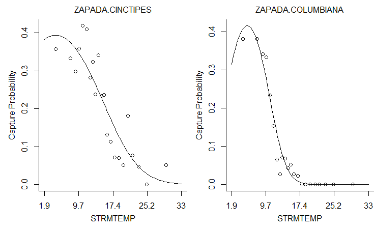
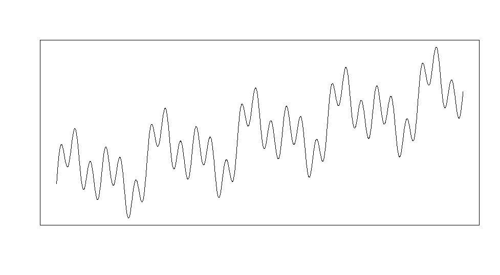
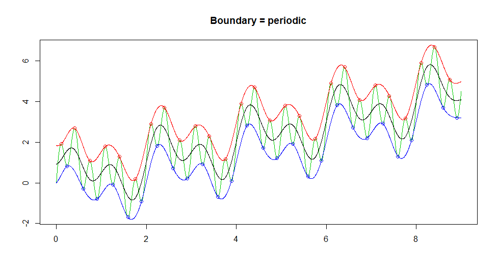
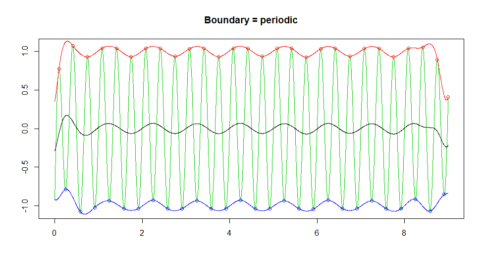
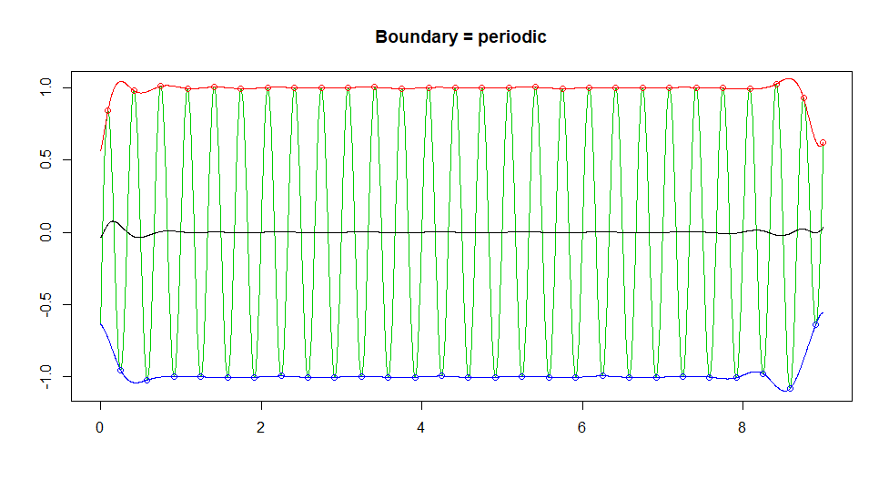
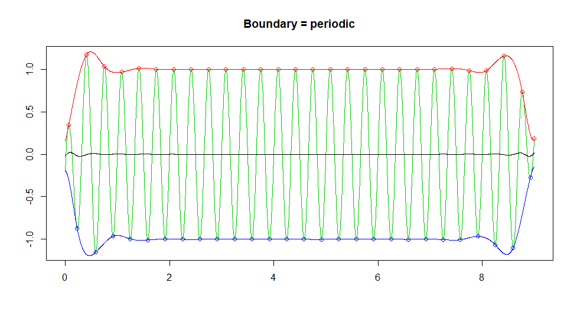

```{r setup, include=FALSE}
knitr::opts_chunk$set(echo = TRUE, error = TRUE, warning=FALSE, cache = TRUE)
```

# Introduction

Sprawozdanie to skoncentruje się na odtwarzalności sześciu różnych artykułów, z czego pierwsze trzy są nieco powiązane ze sobą.

O ile nie określono inaczej (lub nie pojawił się po nich komunikat o błędzie), przedstawione wyniki należy traktować jako identyczne z tymi, które podano w artykule. Należy też zauważyć, że w jakiś sposób wszystkie badane w tym raporcie pakiety okazały się być nadal utrzymane i dostępne dla obecnej (3.6.3) wersji R.

# [The *ade4* Package: Implementing the Duality Diagram for Ecologists](https://www.jstatsoft.org/article/view/v022i04)

Cytat z abstraktu artykułu: 

"Analizy wielowymiarowe są dobrze znane i szeroko stosowane do identyfikacji i zrozumienia struktur społeczności ekologicznych. Pakiet ade4 dla środowiska statystycznego R proponuje dużą liczbę metod wieloczynnikowych. Jego wdrożenie jest zgodne z tradycją francuskiej szkoły "Analyse des Donn´ees" i opiera się na wykorzystaniu diagramu dwoistości".

Poniżej znajdują się wyniki przykładowego kodu z gazety.


```{r, include = FALSE}
###################################################
### chunk number 1: option
###################################################
options(prompt="R> ", continue=" ", width = 85) 
```
```{r}
###################################################
### chunk number 5: ni1
###################################################
library(ade4)
apropos("dudi.")
```
```{r}
###################################################
### chunk number 6: ni2
###################################################
args(as.dudi)
```
```{r}
###################################################
### chunk number 7: ni3
###################################################
methods(class="dudi")
```
Oto pierwsze odchylenie od wyników przedstawionych w pracy. Metody, które powinny były zostać przedstawione, są następujące: "print.dudi", "scatter.dudi" i "t.dudi". Należy zauważyć, że metody te są nadal zawarte w pakiecie, chociaż zostały one skrócone do "print.dudi", "scatter" i "t". 

```{r}
###################################################
### chunk number 8: ex1
###################################################
data(dunedata)
sapply(dunedata$envir,class)
```
```{r}
###################################################
### chunk number 9: ex2
###################################################
dunedata$envir$use <- factor(dunedata$envir$use,ordered=FALSE)
summary(dunedata$envir)
```
```{r}
###################################################
### chunk number 10: ex3
###################################################
dd1 <- dudi.hillsmith(dunedata$envir, scannf = FALSE,nf=2)
dd1
```

W tym kawałku wyniki są prawie identyczne, z wyjątkiem ostatniego rzędu: "inne elementy: przypisać normę środkową indeksu cr" zamiast "inne elementy: przypisać indeks cr", cokolwiek to znaczy.
```{r}
###################################################
### chunk number 11: ex4
###################################################
scatter.dudi(dd1)
```

I tu mamy pierwszy błąd. Jak zauważono wcześniej, skrócono nazwy niektórych metod, np. "scatter.dudi". W obecnym pakiecie nazywa się to po prostu "scatter()".

```{r}
scatter(dd1)
```

Po wywołaniu prawidłowej nazwy metody komunikat o błędzie zniknie. Rysowany wykres nie jest jednak taki sam jak w artykule. Wykresy słupkowe w rogu są identyczne, ale z jakiegoś powodu wykres w tle jest odwróconą wersją wykresu przedstawionego w artykule. 

Można powiedzieć, że artykuł jest na ogół powtarzalny

# [*untb*, an R Package For Simulating Ecological Drift Under the Unified Neutral Theory of Biodiversity](https://www.jstatsoft.org/article/view/v022i12)

Zgodnie z cytatem z abstraktu: 

„Rozkład liczebności wśród gatunków o podobnych stylach życia jest klasycznym problemem w ekologii.

Zunifikowana neutralna teoria bioróżnorodności (...) stwierdza, że obserwowaną dynamikę populacji można wyjaśnić przy założeniu równoważności liczby osób na mieszkańca. Można zatem zrezygnować z różnic między gatunkami oraz różnic między licznymi i rzadkimi gatunkami: wszystkie osobniki zachowują się jednakowo pod względem prawdopodobieństwa rozmnażania i śmierci.

Jest (...) faktem, że taka oszczędna teoria skutkuje nietrywialną krzywą różnorodności dominacji (to znaczy jednoczesnym istnieniem zarówno gatunków obfitych, jak i rzadkich) i (...) teoria przewiduje krzywe liczności pasujące do siebie obserwacje w szerokim zakresie ekologii.

(...) Pakiet untb [składa się z] procedur R do numerycznej symulacji dryfu ekologicznego w ramach zunifikowanej teorii neutralnej. Pakiet narzędzi wizualizacyjnych, analitycznych i symulacyjnych znajduje się w pakiecie (...). ”

```{r, include = FALSE}
###################################################
### chunk number 2: 
###################################################
require(untb)
```
```{r}
###################################################
### chunk number 3: SaundersSummary
###################################################
data(saunders)
summary(saunders.tot)
```
```{r}
###################################################
### chunk number 4: prestonSaunders
###################################################
preston(saunders.tot,n=9)
```
```{r}
###################################################
### chunk number 5: prestonSaundersTemp
###################################################
jj.preston <- preston(saunders.tot)
jj.summary <- summary(saunders.tot)
```
```{r}
###################################################
### chunk number 6: calculate_uncertainty_Saunders
###################################################
n <- 10
J <- no.of.ind(saunders.tot)
unc <- list()
theta_hat <- optimal.theta(saunders.tot)
for(i in 1:n){
  unc[[i]] <- rand.neutral(J=J, theta=theta_hat)
}
```
```{r}
###################################################
### chunk number 7: plotSaunders
###################################################
plot(saunders.tot,uncertainty=FALSE)
for(i in 1:n){
  points(unc[[i]],type="l",col="grey")
}
```

Jak można się domyślić, powyższy wykres znacznie różni się od tego w artykule. Jest on całkowicie nieczytelny. Jest to również pierwsza rozbieżność z wynikami przedstawionymi w artykule.

```{r}
###################################################
### chunk number 8: optimalThetaSaunders
###################################################
optimal.theta(saunders.tot)
```
```{r}
###################################################
### chunk number 9: supportTheta
###################################################
S <- no.of.spp(saunders.tot)
J <- no.of.ind(saunders.tot)
theta <- seq(from=25,to=39,len=55)
jj <- theta.likelihood(theta=theta,S=S,J=J,give.log=TRUE)
support <- jj-max(jj)
plot(theta,support,xlab=paste("Biodiversity parameter",expression(theta)),ylab="support")
abline(h= -2)
```
```{r}
###################################################
### chunk number 10: 
###################################################
load("bci1982.Rdata")
```

Podany w artykule [link](http://ctfs.si.edu/datasets/bci) do powyższego zbioru danych nie prowadzi do niczego. Krótkie wyszukiwanie w google nie pomogło w jego zlokalizowaniu. Możliwe że przepadł na zawsze. Z tego powodu większość poniższych fragmentów prowadzi do błędów.
```{r}
###################################################
### chunk number 11: optimal.params
###################################################
op.bci.1982 <- optimal.params(bci1982, l)
```
```{r}
###################################################
### chunk number 12: flish2
###################################################
op.bci.1982
```
```{r}
###################################################
### chunk number 13: estimateMandTheta
###################################################
load("mle.Rdata")
plot(x100,log="xy",xlim=c(1,80),ylim=c(0.001,1),col="black",pch=1,
main=paste("Maximum likelihood estimates of ", expression(m), " and ",expression(theta))
     )
points(x1000,col="red",pch=2) 
points(x10000,col="blue",pch=3) 

points(50,0.01,pch=4,lwd=3,cex=2)

legend( "bottomleft", c("100","1000","10000"),col=c("black","red","blue"), pch=1:3, title="Local community size")
```
```{r}
###################################################
### chunk number 14: e.lowandhigh
###################################################
n <- 20
x <- expected.abundance(J=n, theta=3)
e.low  <- expected.abundance(J=n,theta=4)
e.high <- expected.abundance(J=n,theta=2)
```
```{r}
###################################################
### chunk number 15: expectedAbundance
###################################################
plot(x)
segments(x0=1:n,x1=1:n,y0=e.low,y1=e.high)
```

Powyższy wykres nie wykorzystuje brakującego zestawu danych i tym samym pozostaje wierny temu, który został przedstawiony w artykule.
```{r}
###################################################
### chunk number 16: calculate_thirdRank
###################################################
rank3 <- table(replicate(1000,rand.neutral(J=20,theta=2)[3]))
```
```{r}
###################################################
### chunk number 17: plot_thirdRank
###################################################
plot(rank3,xlab="abundance of third ranked species",ylab="frequency")
```

Tak samo jak powyżej.
```{r}
###################################################
### chunk number 18: calculate_species_table
###################################################
 {
set.seed(0);
a <- species.table(untb(start=rep(1,60),prob=0.002, gens=40000,keep=TRUE))
}
```
```{r}
###################################################
### chunk number 19: matplot_species_table
###################################################
matplot(a,type="l",lty=1,xlab="time (generation)",ylab="abundance")
```

W przeciwieństwie do dwóch powyższych wykresów, o ile ten może być jeszcze wygenerowany, to znacznie różni się od wyniku pokazanego w artykule. 
```{r bitch, eval = FALSE}
###################################################
### chunk number 20: SampleTenThousand
###################################################
set.seed(0)
rn <- rand.neutral(5e6, theta=50)
jj <- isolate(rn,size=10000)
a <- untb(start=jj, prob=0.01, D=10000, gens=1000, meta=rn)
a.logkda <- logkda(a)
```
```{r}
op <- optimal.params(a,log.kda=a.logkda)
v.opt <- volkov(no.of.ind(a), op, bins=TRUE)
v.true <- volkov(no.of.ind(a), c(100,0.01), bins=TRUE)
```
```{r, include = FALSE}
load(file = "aaa.RData")
```


```{r}
###################################################
### chunk number 21: PlotSampleTenThousand
###################################################
pa <- preston(a,n=12)
pa.names <- sub(" ", "", names(pa))
jj <- plot(pa,ylim=c(0,27),axisnames=FALSE,
ylab="Number of species",xlab="Abundance class")
axis(1, at=jj, labels=FALSE, lty=0)
text(jj, par("usr")[3]-0.65, srt=90, cex=0.8, adj=1, labels=pa.names,xpd=TRUE)

points(jj, v.opt[1:12], type="b",col="red",pch=1)
points(jj, v.true[1:12], type="b",col="blue",pch=4)
par(xpd=2)
legend("topright", c("best estimate","true"), pch=c(1,4), col=c("red","blue"), lty=c(1,1))
```

Wykres jest prawie identyczny, ale z powodu problemów z "optimal.params" brakuje na nim linii "best estimate".
```{r}
###################################################
### chunk number 22: differentThetas
###################################################
set.seed(0)
f <- function(gens,p){
  display.untb(start=sample(as.census(untb(start=1:100,gens=gens,D=100,prob=p))),gens=0,main="",cex=1.7, asp=1)
}

g <- function(u="title", ...){
  par(srt=0)
  par(mai=c(0,0,0,0))
  plot.new()
  text(0.5,0.5,u,...)
}

h <- function(u="title", ...){
  par(mai=c(0,0,0,0))
  par(srt=90)
  plot.new()
  text(0.5,0.5,u, ...)
}

nf <- layout(matrix(
                    c(00,01,00,02,00,03,
                      04,05,00,06,00,07,
                      00,00,00,00,00,00,
                      08,09,00,10,00,11,
                      00,00,00,00,00,00,
                      12,13,00,14,00,15,
                      00,00,00,00,00,00,
                      16,17,00,18,00,19),8,6,byrow=TRUE),
             c(1,4, 1,4, 1,4),
             c(1,4, 1,4, 1,4, 1,4),
             TRUE)

g(expression(t==10))
g(expression(t==50))
g(expression(t==100))

h(expression(theta==0))
f(10,0)
f(50,0)
f(100,0)
h(expression(theta==0.1))
f(10,0.001)
f(50,0.001)
f(100,0.001)
h(expression(theta==1))
f(10,0.01)
f(50,0.01)
f(100,0.01)
h(expression(theta==10))
f(10,0.1)
f(50,0.1)
f(100,0.1)
```

Ten wykres, choć na pierwszy rzut oka wydaje się podobny, jest zupełnie inny.  

Podobnie jak wcześniejszy pakiet, *untb* jest również nadal utrzymany. Oryginalny artykuł z 2007 roku jest o wiele mniej powtarzalny niż ten opisujący *ade4*. Mniej niż połowa wykresów jest możliwa do odtworzenia. W sumie artykuł jest w większości nie do odtworzenia.

# [The *bio.infer* R Package: Maximum Likelihood Method for Predicting Environmental Conditions from Assemblage Composition](https://www.jstatsoft.org/article/view/v022i03)

Cytowane z artykułu: 
"(...) Pakiet R bio.infer [jest] zestawem skryptów ułatwiających wykorzystanie metod maksymalnego prawdopodobieństwa (ML) do przewidywania warunków środowiskowych. (...) 
Warunki środowiskowe można często wywnioskować wyłącznie na podstawie danych biologicznych, a wnioski te są przydatne, gdy dostępne są inne źródła danych. Metody prognozowania ML są statystycznie rygorystyczne i mają zastosowanie do szerszego zestawu problemów niż powszechnie stosowane techniki uśredniania ważonego. Metody ML wymagają jednak znacznie większego nakładu czasu na programowanie algorytmów i wykonywanie obliczeń. Pakiet ten został opracowany w celu zmniejszenia nakładu pracy potrzebnego do zastosowania metod predykcji ML"

```{r}
# Merge EMAP biological data with standardized taxonomy
library(bio.infer)
options(width = 60)
data(itis.ttable)
data(bcnt.emapw)
bcnt.tax <- get.taxonomic(bcnt.emapw, itis.ttable,
                          outputFile = "sum.tax.table.txt")
```

Podczas gdy pierwszy kawałek powodujący komunikat o błędzie może wydawać się zniechęcający, jest on stosunkowo łatwy do rozwiązania. Jak stwierdzono wcześniej, wszystkie pakiety są utrzymywane i od 2007 roku były wielokrotnie aktualizowane. Metoda "get.taxonomic" została uproszczona i obecnie nie wymaga dwóch ostatnich argumentów.
```{r, eval = FALSE}
bcnt.tax <- get.taxonomic(bcnt.emapw)
```
```{r}
# Show excerpt from full taxonomic table
df1 <- read.delim("sum.tax.table.txt")
incvec <- df1[, "FAMILY"] == "EPHEMERIDAE"
incvec[is.na(incvec)] <- F
print(df1[incvec,c("ORDER", "FAMILY", "GENUS", "SPECIES", "TAXANAME")])
```

Kolejny błąd: ten spowodowany zmianą kolumny "TAXANAME" na "taxaname.orig".
```{r}
print(df1[incvec,c("ORDER", "FAMILY", "GENUS", "SPECIES", "taxaname.orig")])
```
```{r}
# compute taxon-environment relationships for EMAP species data only
data(envdata.emapw)
coef <- taxon.env(form = ~STRMTEMP + STRMTEMP^2, bcnt = bcnt.tax, 
                  envdata = envdata.emapw, bcnt.siteid = "ID.NEW",
                  bcnt.abndid = "ABUND", env.siteid = "ID.NEW",
                  tlevs = "SPECIES", dumpdata = TRUE)
```

Wyniki w artykule to "64", a nie "59".
```{r}
# Echo names of coefficient data
names(coef)
```
```{r, eval = FALSE}
# View taxon-environment relationships
view.te(coef,plotform = "windows")
```



# [The *pls* Package: Principal Component and Partial Least Squares Regression in R](https://www.jstatsoft.org/article/view/v018i02)

## Opis

Z abstraktu artykułu:
"Pakiet pls implementuje regresję głównych składników (PCR) i częściową regresję najmniejszych kwadratów (PLSR) w R. (...) Kontrola wizualna i ocena jest ważna w chemometrii, a pakiet pls posiada szereg funkcji wykresów punktacji, obciążeń, przewidywań, współczynników i szacunków RMSEP."

Poniżej znajdują się wyniki przykładowego kodu z artykułu.

## Reprodukcja

```{r}
###################################################
library("pls")
```


```{r}
###################################################
data("yarn")
data("oliveoil")
data("gasoline")

```


```{r}
###################################################
matplot(t(gasoline$NIR), type = "l", lty = 1, ylab = "log(1/R)", xaxt = "n")
ind <- pretty(seq(from = 900, to = 1700, by = 2))
ind <- ind[ind >= 900 & ind <= 1700]
ind <- (ind - 898) / 2
axis(1, ind, colnames(gasoline$NIR)[ind])

```


```{r}
###################################################
gasTrain <- gasoline[1:50,]
gasTest <- gasoline[51:60,]

```


```{r}
###################################################
gas1 <- plsr(octane ~ NIR, ncomp = 10, data = gasTrain, validation = "LOO")

```


```{r}
###################################################
summary(gas1)

```

Tutaj znajduje się nasza pierwsza rozbieżność z atykułem. W ostatniej linijce, ostatnimi wartościami są `99.2`, `99.41` zamiast `99.19` i `99.39`. W dalszej części możemy więc spodziewać się innych zaokrągleń.


```{r}
###################################################
plot(RMSEP(gas1), legendpos = "topright")

```

Zarówno wykres powyżej jak i 2 dalsze wykresy wydają się za to identyczne.

```{r}
###################################################
plot(gas1, ncomp = 2, asp = 1, line = TRUE)

```


```{r}
###################################################
plot(gas1, plottype = "scores", comps = 1:3)

```


```{r}
###################################################
explvar(gas1)

```

Tutaj tak samo jak wcześniej, liczby różnią się zaokrągleniami. W artykule podane są 4 liczby po przecinku gdy tutaj podane jest aż 7.


```{r}
###################################################
plot(gas1, "loadings", comps = 1:2, legendpos = "topleft", labels = "numbers", xlab = "nm")
abline(h = 0)

```


```{r}
###################################################
predict(gas1, ncomp = 2, newdata = gasTest)

```

Podobnie jak wyżej: tutaj 5 miejsc po przecinku, w artykule 2.

```{r}
###################################################
RMSEP(gas1, newdata = gasTest)

```

Tutaj za to mamy kolejną zmianę: w reprodukcji wartością `Intercept` jest `1.53369`, kiedy w artykule jest to `1.5114`. Pozostałe wartości są identyczne. Może to świadczyć o tym, że w nowszych wersjach R-a jest inny seed.


```{r}
###################################################
dens1 <- plsr(density ~ NIR, ncomp = 5, data = yarn)

```


```{r}
###################################################
dim(oliveoil$sensory)
plsr(sensory ~ chemical, data = oliveoil)

```


```{r}
###################################################
trainind <- which(yarn$train == TRUE)
dens2 <- update(dens1, subset = trainind)

```


```{r}
###################################################
dens3 <- update(dens1, ncomp = 10)

```


```{r}
###################################################
olive1 <- plsr(sensory ~ chemical, scale = TRUE, data = oliveoil)

```


```{r}
###################################################
gas2 <- plsr(octane ~ msc(NIR), ncomp = 10, data = gasTrain)

```


```{r}
###################################################
predict(gas2, ncomp = 3, newdata = gasTest)

```


```{r}
###################################################
gas2.cv <- crossval(gas2, segments = 10)
plot(MSEP(gas2.cv), legendpos='topright')
summary(gas2.cv, what = "validation")

```

Tutaj za to wyniki różnią się o +/- kilka tysięcznych. Znowu jest to winą innego seeda, gdyż tutaj jest kroswalidacja przy uzyciu losowych segmentów.


```{r}
###################################################
plot(gas1, plottype = "coef", ncomp=1:3, legendpos = "bottomleft", labels = "numbers", xlab = "nm")

```


```{r}
###################################################
plot(gas1, plottype = "correlation")

```


```{r}
###################################################
predict(gas1, ncomp = 2:3, newdata = gasTest[1:5,])

```

Tutaj znowu zaokrąglenia do piątej liczby po przecinku, kiedy w artykule jest do drugiej.


```{r}
###################################################
predict(gas1, comps = 2, newdata = gasTest[1:5,])

```

Tak samo jak wyżej.


```{r}
###################################################
drop(predict(gas1, ncomp = 2:3, newdata = gasTest[1:5,]))

```

Jak wyżej.


```{r}
###################################################
predplot(gas1, ncomp = 2, newdata = gasTest, asp = 1, line = TRUE)

```


```{r}
###################################################
pls.options()

```

Tutaj za to widać że pakiet się rozwinał, bo w artykule jako output pokazane są tylko `$mvralg`, `$plsralg` i `$pcralg`. Do tego `$plsralg` ma tam wartość ` "kernelpls"`.


```{r}
###################################################
pls.options(plsralg = "oscorespls")

```


```{r}
###################################################
pls.options("plsralg")
rm(.pls.Options)
pls.options("plsralg")

```

Tutaj tak samo `$plsralg` powinno mieć wartość `"kernelpls"`.


```{r}
###################################################
X <- gasTrain$NIR
Y <- gasTrain$octane
ncomp <- 5
cvPreds <- matrix(nrow = nrow(X), ncol = ncomp)
for (i in 1:nrow(X)) {
    fit <- simpls.fit(X[-i,], Y[-i], ncomp = ncomp, stripped = TRUE)
    cvPreds[i,] <- (X[i,] - fit$Xmeans) %*% drop(fit$coefficients) + fit$Ymeans
}

```


```{r}
###################################################
sqrt(colMeans((cvPreds - Y)^2))

```

Tak samo jak wcześniej tutaj zaokrąglenia do siódmej liczby a nie jak w artykule do czwartej.

### Podsumowanie

Artykuł jest bardzo reprodukowalny. Wyniki są praktycznie takie same, różnią się jedynie w przypadku bardziej dokładnych rozwinięć i losowo wybranych obiektów, prawdopodobnie przez innego seeda. Widać też że pakiet ten został od zamieszczenia go rozwinięty.


# Empirical Mode Decomposition and Hilbert Spectrum

Ten artykuł (Donghoh i Hee-Seok, 2009) dotyczy pakietu [`EMD`](https://cran.r-project.org/web/packages/EMD/index.html) służącego do dekompozycji sygnału na tzw. intrinsic mode function (funkcja trybu wewnętrznego).

Link do artykułu: [`https://doi.org/10.32614/RJ-2009-002`](https://doi.org/10.32614/RJ-2009-002)

## Intrinsic mode function

### Przygotowanie danych

```{r}
ndata <- 3000
tt <- seq(0, 9, length=ndata)
xt <- sin(pi * tt)
```

### Wywołanie funkcji

```{r}
library(EMD)
extrema(xt)
```

Nie było problemów z reprodukcją tego fragmentu.

### Przesiewanie

### Przygotowanie danych

```{r}
ndata <- 3000
par(mfrow=c(1,1), mar=c(1,1,1,1))
tt2 <- seq(0, 9, length=ndata)
xt2 <- sin(pi * tt2) + sin(2* pi * tt2) + sin(6 * pi * tt2)  + 0.5 * tt2
```

## Rezultaty

```{r, results=FALSE, eval=FALSE}
plot(tt2, xt2, xlab="", ylab="", type="l", axes=FALSE); box()
tryimf <- extractimf(xt2, tt2, check=TRUE)
```

Ta część nie jest w pełni odtwarzalna. Nie byliśmy w stanie zarejestrować wszystkich etapów procesu przesiewania.
Różnił się on również od oryginału.

  
  

## Empirical mode decomposition

### Wywołanie funkcji

```{r}
par(mfrow=c(3,1), mar=c(2,1,2,1))
try <- emd(xt2, tt2, boundary="wave")
```

### Wykres IMF

To było bardzo proste zadanie, które zostało całkowicie odtworzone.

```{r}
par(mfrow=c(3,1), mar=c(2,1,2,1))
par(mfrow=c(try$nimf+1, 1), mar=c(2,1,2,1))
rangeimf <- range(try$imf)
for(i in 1:try$nimf){
  plot(tt2, try$imf[,i], type="l", xlab="", ylab="",
       ylim=rangeimf, main= paste(i, "-th IMF", sep="")); 
  abline(h=0)
}
plot(tt2, try$residue, xlab="", ylab="", main="residue", type="l")
```

## Okresowość

### Mode mixing

Ta część również daje te same wyniki co w oryginalnym artykule.

```{r}
tt <- seq(0, 0.1, length = 2001)[1:2000]
f1 <- 1776; f2 <- 1000
xt <- sin(2*pi*f1*tt) * (tt <= 0.033 | tt >= 0.067) + sin(2*pi*f2*tt)
```

## EMD

```{r}
interm1 <- emd(xt, tt, boundary="wave", max.imf=2, plot.imf=FALSE)
par(mfrow=c(3, 1), mar=c(3,2,2,1))
plot(tt, xt, main="Signal", type="l")
rangeimf <- range(interm1$imf)
plot(tt, interm1$imf[,1], type="l", xlab="", ylab="", ylim=rangeimf, main="IMF 1")
plot(tt, interm1$imf[,2], type="l", xlab="", ylab="", ylim=rangeimf, main="IMF 2")
```

## Histogram of empirical period

Histogram został poprawnie odtworzony.

```{r}
par(mfrow=c(1,1), mar=c(2,4,1,1))
tmpinterm <- extrema(interm1$imf[,1])
zerocross <- as.numeric(round(apply(tmpinterm$cross, 1, mean)))
hist(diff(tt[zerocross[seq(1, length(zerocross), by=2)]]), freq=FALSE, xlab="", main="")
```

## Treating intermittence

```{r}
interm2 <- emd(xt, tt, boundary="wave", max.imf=2, plot.imf=FALSE, interm=0.0007)
```

## Wykres każdego IMF

```{r}
par(mfrow=c(2,1), mar=c(2,2,3,1), oma=c(0,0,0,0))
rangeimf <- range(interm2$imf)
plot(tt,interm2$imf[,1], type="l", main="IMF 1 after treating intermittence",
     xlab="", ylab="", ylim=rangeimf)
plot(tt,interm2$imf[,2], type="l", main="IMF 2 after treating intermittence",
     xlab="", ylab="", ylim=rangeimf)
```

## Spektrum Hilberta

Oba spektrogramy zostały odtworzone bez problemów, ale są mało widoczne.

## First Spectrogram

```{r}
test1 <- hilbertspec(interm1$imf)
spectrogram(test1$amplitude[,1], test1$instantfreq[,1])
```

## Drugi spektrogram

```{r}
test2 <- hilbertspec(interm2$imf, tt=tt)
spectrogram(test2$amplitude[,1], test2$instantfreq[,1])
```

## Extension to two dimensional image

## Wczytywanie danych i rozkład

```{r}
data(lena)
z <- lena[seq(1, 512, by=4), seq(1, 512, by=8)]
```

Przetworzenie tej części zajmuje najwięcej czasu. Dlatego postanowiliśmy zmniejszyć rozmiar zdjęcia jeszcze bardziej niż autorzy artykułu.

```{r}
lenadecom <- emd2d(z, max.imf = 4)
```

Ta część jest w pełni odtwarzalna.

## Result plot

```{r, fig.width=4, fig.height=8}
imageEMD(z=z, emdz=lenadecom, extrema=TRUE, col=gray(0:100/100))
```


# AdMit: Adaptive Mixtures of Student-t Distributions
## Opis
`AdMit` jest pakietem opisanym w wydaniu [The R Journal](https://journal.r-project.org/archive/2009/RJ-2009-003/index.html) pochodzącym z czerwca 2009 roku. Najnowsza wersja na [CRAN](https://cran.r-project.org/web/packages/AdMit/index.html) została wypuszczona 20 kwietnia 2020, zatem jak najbardziej podchodzi pod kategorię *wciąż aktualizowanych starych pakietów*.\
Autorzy artykułu nie dołączyli dodatkowych źródeł kodu ani skryptów, jednak kod generujący wyniki jest podany w paragrafach w tekście, tak jak zostałby wpisany do konsoli `R`. Spowodowało to dodatkowe niepotrzebne kopiowanie i formatowanie. 

## Reprodukcja

```{r}
# install.packages("AdMit")
library(AdMit)
```
W wersji `R 3.6.3` instalacja odbyła się szybko, bez żadnych komplikacji.\
.\
.\
.\
```{r}
set.seed(1234)
```
To ziarno zostało podane przez autoróœ. Ponieważ jest powszechnie wiadome, że aktualizacja `R 3.6.0` zmieniła sposób działania generatora losowości, więc już teraz można się spodziewać trochę odmiennych wyników.\
.\
.\
.\
```{r}
GelmanMeng <- function(x, log = TRUE) {
    if (is.vector(x)) x <- matrix(x, nrow = 1)
    r <- -0.5 * ( 5 * x[,1]^2 * x[,2]^2 + x[,1]^2 + x[,2]^2 - 10 * x[,1] * x[,2] - 6 * x[,1] - 7 * x[,2] )
    if (!log) r <- exp(r)
    as.vector(r)
}
```
Powyższy kod tworzy jądro (*kernel*), który później jest wizualizowany na wykresach, iestety kod generujący je nie został załączony.\
.\
.\
.\
```{r}
(outAdMit <- AdMit(KERNEL = GelmanMeng, mu0 = c(0, 0.1)))
(outAdMitIS <- AdMitIS(N = 1e5, KERNEL = GelmanMeng, mit = outAdMit$mit))
```
Wyniki są z reguły trochę różne od oryginalnych, najprawdopodobniej głównie z powodu innego generatora liczb losowych. Ponadto można zauważyć, że stosowana jest inna metoda zaokrąglania liczb.\
.\
.\
.\
```{r, results='hide'}
(outAdMitMH <- AdMitMH(N = 101000, KERNEL = GelmanMeng, mit = outAdMit$mit))
```
Ten kod w `markdown` generuje $50000$ linijek wyników i z dumą oświadcza, że pominął kolejne $50000$, jednak w samym `R` generują się one w przystępny sposób.\
.\
.\
Na potrzeby tego artykułu trzeba było przepisać tę linijkę kodu.
```{r}
# rewritten upper chunk
head(outAdMitMH$draws, 7)
outAdMitMH$accept
```
Tutaj ponownie wyniki są prawie równe oryginalnym.\
.\
.\
.\
```{r}
library("coda")
draws <- as.mcmc(outAdMitMH$draws)
draws <- window(draws, start = 1001)
colnames(draws) <- c("X1", "X2")
summary(draws)$stat

effectiveSize(draws) / niter(draws)
```
W tym miejscu wprowadzony został pakiet `coda`, w celu sprawdzenia osiągów `AdMit`. Szczęśliwie również i on zainstalował się i działał bez komplikacji, a wyniki prawie wyglądają jak te oryginalne.

## Podsumowanie
Podsumowując, `AdMit` jest przykładem *wciąż aktualizowanego starego pakietu*, którego działanie różni się trochę od wersji z 2009 roku, ale mówiąc ogólnie - wciąż działa tak, jak było to zamierzone.

# Wnioski
* Nastąpiła zmiana seeda, co przeszkadza w dokładnej reprodukcji;
* Zdarza się, że zbiory danych są już niedostępne;
* Mogły nastąpić zmiany nazw.

Jendak ogólnie mówiąc, jest to możliwe do zreprodukowania przy niewielkim nakładzie pracy i zrozumieniu działania kodu.